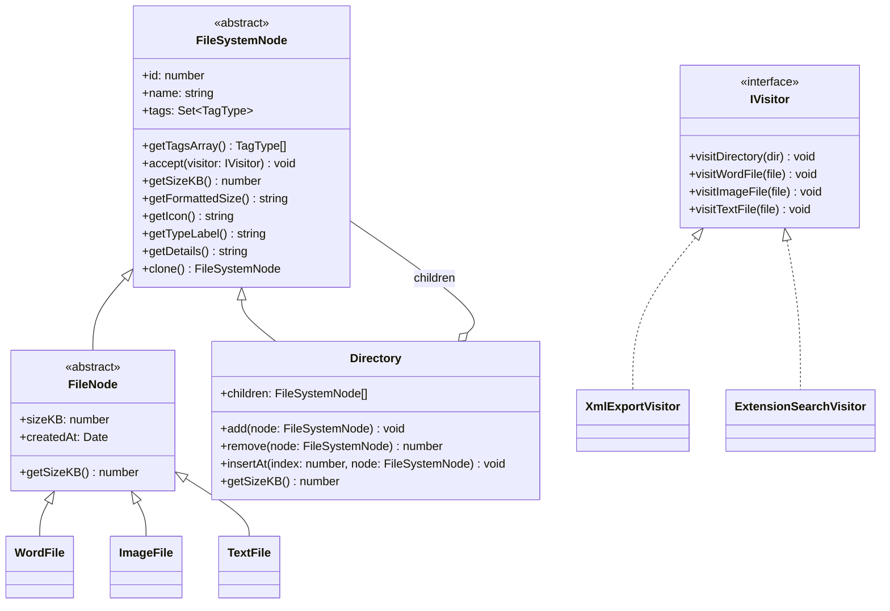
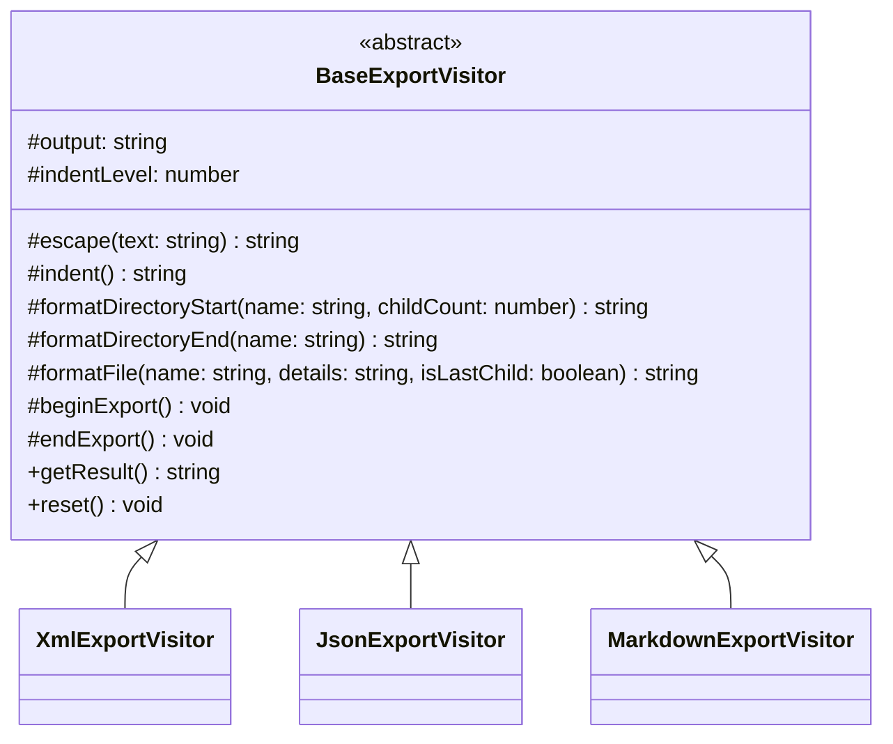
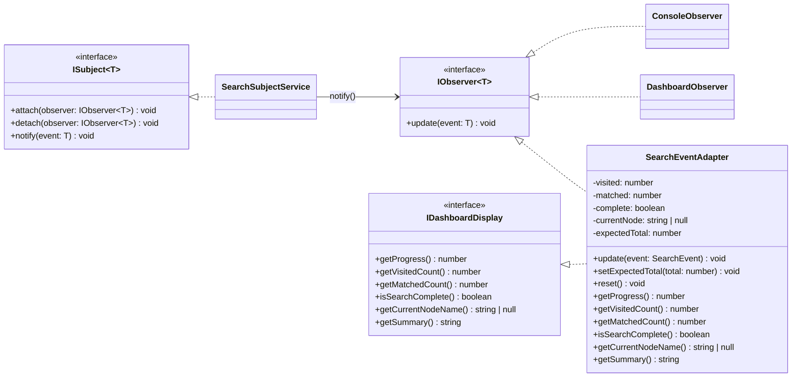
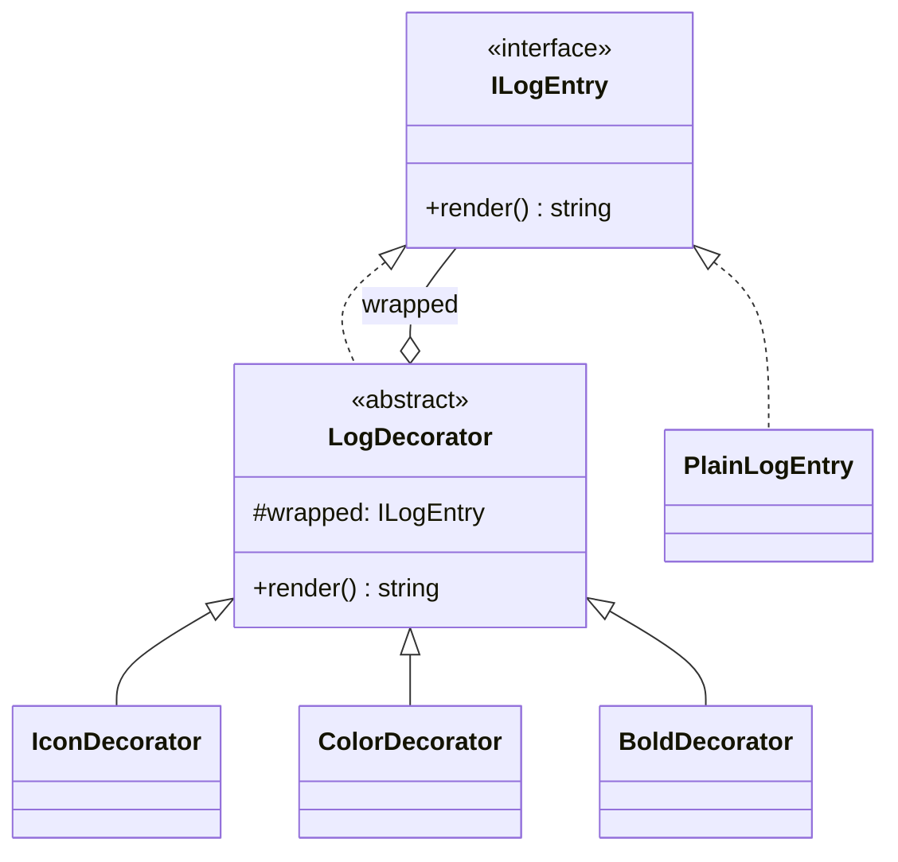
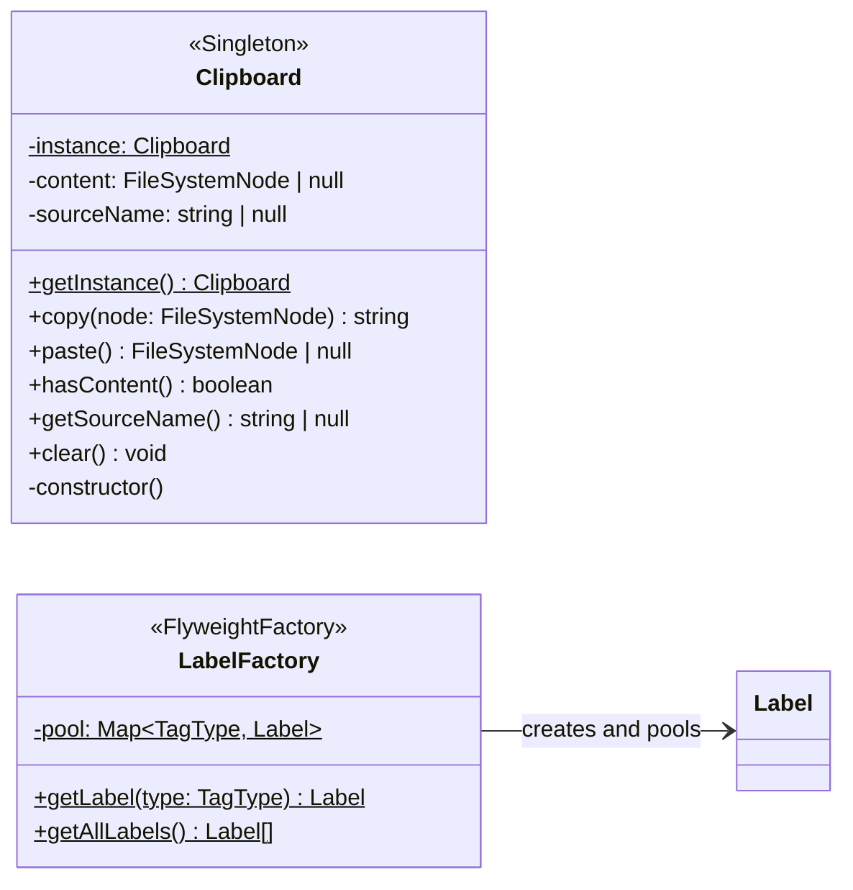
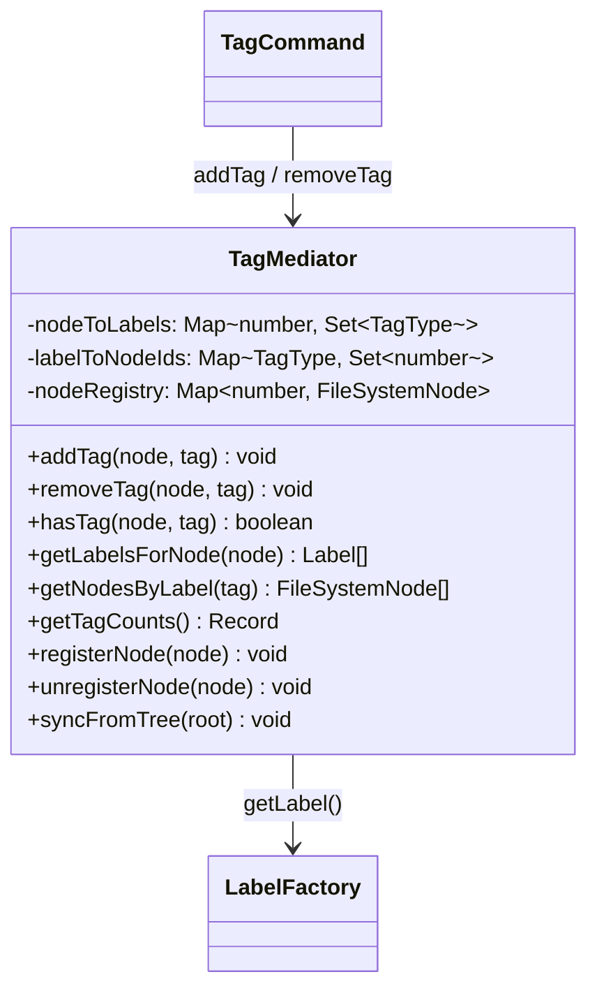
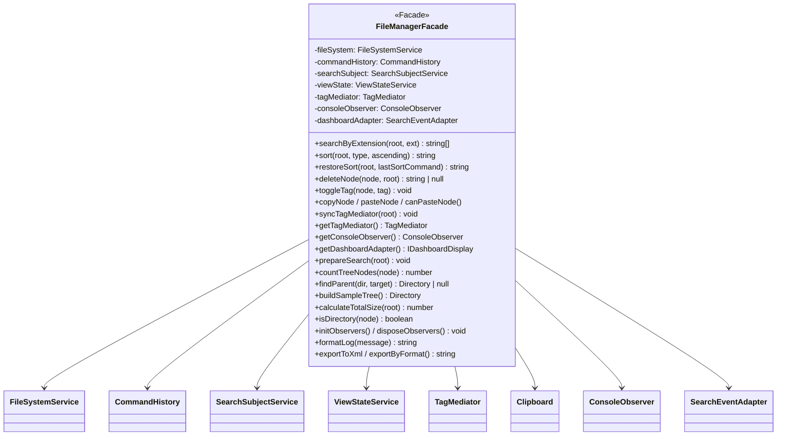

# ☁️ 雲端檔案管理系統 — Design Patterns Demo

> 以 **Angular 21** 打造的**系統分析與設計（SA&D）教學暨實作展示平台**，透過「雲端檔案管理系統」真實業務情境，完整展示 **13 個 GoF 設計模式**（Creational × 3 + Structural × 4 + Behavioral × 6）的實務應用。

[](https://angular.dev/)
[](https://www.typescriptlang.org/)
[](https://mermaid.js.org/)
[](https://vitest.dev/)
[](src/app/core-logic.spec.ts)
[](LICENSE)

---

## 📖 目錄

- [專案概述](#-專案概述)
- [教學頁面導覽](#-教學頁面導覽)
- [分層架構](#-分層架構)
- [GoF 模式地圖](#-gof-模式地圖)
- [設計模式詳解](#-設計模式詳解)
  - [Composite Pattern（組合模式）](#composite-pattern組合模式)
  - [Visitor Pattern（訪問者模式）](#visitor-pattern訪問者模式)
  - [Template Method Pattern（模板方法模式）](#template-method-pattern模板方法模式)
  - [Observer Pattern（觀察者模式）](#observer-pattern觀察者模式)
  - [Command Pattern（命令模式）](#command-pattern命令模式)
  - [Strategy Pattern（策略模式）](#strategy-pattern策略模式)
  - [Decorator Pattern（裝飾器模式）](#decorator-pattern裝飾器模式)
  - [Adapter Pattern（適配器模式）](#adapter-pattern適配器模式)
  - [Singleton Pattern（單例模式）](#singleton-pattern單例模式)
  - [Factory Method Pattern（工廠方法模式）](#factory-method-pattern工廠方法模式)
  - [Flyweight Pattern（享元模式）](#flyweight-pattern享元模式)
  - [Mediator Pattern（中介者模式）](#mediator-pattern中介者模式)
  - [Facade Pattern（外觀模式）](#facade-pattern外觀模式)
- [類別架構圖](#-類別架構圖)
- [技術棧](#-技術棧)
- [快速開始](#-快速開始)
- [專案結構](#-專案結構)
- [功能展示](#-功能展示)
- [測試](#-測試)
- [如何擴展](#-如何擴展)
- [參考資源](#-參考資源)
- [設計文件導覽](#-設計文件導覽)
- [完整規格書（docs/spec.md）](docs/spec.md)

---

## 📚 設計文件導覽

| 文件       | 連結                                 | 用途                                                       |
| ---------- | ------------------------------------ | ---------------------------------------------------------- |
| 專案總覽   | [README.md](README.md)               | 快速理解專案目標、模式地圖、啟動方式與主要範例             |
| 完整規格書 | [docs/spec.md](docs/spec.md)         | 正式規格主文件（Use Case、Class、State、ER、Sequence、C4） |
| ER 模型    | [docs/er-model.md](docs/er-model.md) | 獨立資料模型與 Data Dictionary（供 DB 設計與評審）         |

建議閱讀順序：`README` → `docs/spec.md` → `docs/er-model.md`。

---

## 🎯 專案概述

本專案以 **SA&D 設計流程**（URD → Use Case → Class Diagram → Collaboration → Sequence → Architecture → 實作）為主軸，模擬一個雲端檔案管理系統，使用者可以：

- 🌲 瀏覽巢狀目錄結構（Composite Pattern）
- 📊 計算所有檔案的總容量
- 📑 將整棵目錄樹匯出為 XML / JSON / Markdown（Visitor + Template Method）
- 🔍 依副檔名搜尋檔案（Visitor + Observer Pattern）
- 📡 搜尋時即時高亮匹配節點 + Console 顯示樹狀走訪進度（Observer + Adapter Pattern）
- 📋 複製 / 貼上節點（Command + Singleton Pattern）
- 🔀 多維度排序 — 依名稱、大小、副檔名、標籤，支援升冪 / 降冪（Strategy Pattern）
- 🗑️ 刪除檔案或資料夾（Command Pattern）
- 🏷️ 標籤管理 — Urgent / Work / Personal，支援多標籤（Command + Mediator + Flyweight）
- ↩️ Undo / Redo — 所有操作皆可撤銷與重做（Command Pattern）
- 📝 日誌裝飾整合時間戳 + 格式化（Decorator Pattern）
- 🎭 統一操作入口（Facade Pattern）

透過真實的業務情境來理解設計模式，而非僅止於抽象概念。

---

## 🗺️ 教學頁面導覽

本平台依 SA&D 設計流程劃分為 **7 個頁面**，每頁聚焦不同階段，並使用 **Mermaid** 互動式圖表（支援點擊放大、縮放、平移）呈現 UML 圖。

| 頁面                    | 路由             | 圖表類型                  | 說明                                                       |
| ----------------------- | ---------------- | ------------------------- | ---------------------------------------------------------- |
| 🏠 **首頁**             | `/`              | —                         | Landing Page，SA&D 流程總覽、URD 需求摘要、設計模式對應表  |
| 📋 **Use Case Diagram** | `/use-case`      | Mermaid `graph LR`        | 使用案例圖：11 個 UC、2 個 Actor、include / extend 關係    |
| 📐 **Class Diagram**    | `/class-diagram` | Mermaid `classDiagram`    | 10 張可展開/收合的類別圖，含全部 13 個設計模式             |
| 🤝 **Collaboration**    | `/collaboration` | Mermaid `graph LR`        | 2 張合作圖：搜尋流程（9 步驟）、排序流程（5 步驟）         |
| 🔄 **Sequence**         | `/sequence`      | Mermaid `sequenceDiagram` | 2 張循序圖：搜尋 `.docx` 流程、排序 + 撤銷流程             |
| 🏗️ **Architecture**     | `/architecture`  | Mermaid `graph TB`        | 三層式系統架構圖：Client → Application → Backend（Future） |
| 🎮 **Live Demo**        | `/demo`          | —                         | 整合所有設計模式的互動式雲端檔案管理系統                   |

> 所有 Mermaid 圖表皆使用 `MermaidDiagramComponent` 共享元件渲染，支援 **點擊放大 → 全螢幕 Modal → 滾輪縮放（25%–500%）→ 滑鼠拖曳平移 → 重置**。

---

## 🧱 分層架構

本專案採用清晰的**分層架構（Layered Architecture）**，確保可維護性與可擴展性。

```

                  View Layer（pages/ + shared/）
  UI 呈現 + 事件綁定，所有模式操作只透過 FileManagerFacade

            Service Layer  services/（依 GoF 三大分類）
  behavioral/
     file-manager-facade.service.ts  Facade Pattern
     command-history.service.ts   Command Invoker
     search-subject.service.ts    Observer Subject
     view-state.service.ts        畫面狀態管理
  structural/
     file-system.service.ts  Composite 業務邏輯

            Model Layer  models/（依 GoF 三大分類）
  creational/
     file.factory.ts          Factory Method
     clipboard.singleton.ts   Singleton
     label.flyweight.ts       Flyweight
  structural/
     file-system-node.model.ts / directory.model.ts  Composite
     log-entry.decorator.ts   Decorator
     search-event.adapter.ts  Adapter
  behavioral/
     visitor / template-method / observer / command / strategy
     mediator / search-event models

```

| 層級        | 目錄                 | 職責                                  | 設計原則           |
| ----------- | -------------------- | ------------------------------------- | ------------------ |
| **View**    | `pages/` + `shared/` | 7 個教學頁面 + Mermaid 共享元件       | 關注點分離         |
| **Model**   | `models/`            | GoF 三大分類統一管理所有模型定義      | 單一職責、開放封閉 |
| **Service** | `services/`          | GoF 三大分類封裝 @Injectable 業務邏輯 | 依賴反轉、單一職責 |

### 分層優勢

- **關注點分離**：Model / Service / View 各司其職，View 層只透過 Facade 存取模式實體
- **可測試性**：124 個單元測試，Service / Command / Strategy 可獨立測試，不依賴 DOM
- **可擴展性**：新增 Visitor、Command 或 Strategy 只需在 `models/behavioral/` 擴充
- **GoF 三大分類**：models/ 與 services/ 皆依 Creational / Structural / Behavioral 組織
- **操作可逆**：Command Layer 讓所有操作都可以 Undo / Redo
- **Angular 最佳實踐**：`inject()` + `providedIn: 'root'` + Signals + OnPush + 新版控制流
- **Lazy Loading**：所有頁面元件皆透過 `loadComponent()` 按需載入

---

## 🗺️ GoF 模式地圖

| 分類            | 模式            | 類別 / 服務                                                                              | 業務用途                                         |
| --------------- | --------------- | ---------------------------------------------------------------------------------------- | ------------------------------------------------ |
| ** Creational** | Factory Method  | `FileFactory`                                                                            | 根據類型建立 FileSystemNode                      |
|                 | Singleton       | `Clipboard`                                                                              | 全域唯一剪貼簿                                   |
|                 | Flyweight       | `Label` + `LabelFactory`                                                                 | 共享標籤物件，避免重複建立                       |
| ** Structural** | Composite       | `Directory` + `FileNode` 子類                                                            | 統一操作檔案與目錄                               |
|                 | Decorator       | `PlainLogEntry` + `IconDecorator` + `ColorDecorator` + `BoldDecorator`                   | 動態附加日誌格式                                 |
|                 | Adapter         | `SearchEventAdapter`                                                                     | 將 `SearchEvent` 轉換為 `IDashboardDisplay` 介面 |
|                 | Facade          | `FileManagerFacade`                                                                      | 統整全部模式入口，降低 UI 耦合                   |
| ** Behavioral** | Visitor         | `XmlExportVisitor` + `ExtensionSearchVisitor`                                            | 不改節點類別，新增操作                           |
|                 | Template Method | `BaseExportVisitor` + `XmlExportVisitor` + `JsonExportVisitor` + `MarkdownExportVisitor` | 固定匯出骨架，子類覆寫格式                       |
|                 | Observer        | `ConsoleObserver` + `DashboardObserver` + `SearchSubjectService`                         | 搜尋事件一對多通知                               |
|                 | Command         | `Sort/Delete/Tag/Copy/PasteCommand`                                                      | 封裝操作，支援 Undo/Redo                         |
|                 | Strategy        | `SortByName/Size/Extension/TagStrategy`                                                  | 可抽換排序演算法                                 |
|                 | Mediator        | `TagMediator`                                                                            | 集中管理標籤檔案多對多關係                       |

---

## 🏗 設計模式詳解

### Composite Pattern（組合模式）

> **意圖**：將物件組合成樹狀結構，使客戶端能以一致的方式處理「單一物件」與「物件群組」。

#### 類別角色對應

| 角色          | 類別                                | 職責                                            |
| ------------- | ----------------------------------- | ----------------------------------------------- |
| **Component** | `FileSystemNode`                    | 抽象基類，定義統一介面                          |
| **Leaf**      | `WordFile`, `ImageFile`, `TextFile` | 具體檔案節點，實作自身行為                      |
| **Composite** | `Directory`                         | 含有 `children: FileSystemNode[]`，遞迴委派操作 |

```typescript
// Composite（目錄  遞迴計算）
class Directory extends FileSystemNode {
  children: FileSystemNode[] = [];
  getSizeKB(): number {
    return this.children.reduce((sum, child) => sum + child.getSizeKB(), 0);
  }
}
```

---

### Visitor Pattern（訪問者模式）

> **意圖**：在不修改既有類別的前提下，定義作用於物件結構的新操作。

```typescript
// Element  Double Dispatch
class WordFile extends FileNode {
  accept(visitor: IVisitor) {
    visitor.visitWordFile(this);
  }
}
```

---

### Template Method Pattern（模板方法模式）

> **意圖**：在基類中定義演算法的骨架，將某些步驟延遲到子類別中實作。

```typescript
abstract class BaseExportVisitor {
  protected output = '';
  protected indentLevel = 0;

  protected abstract escape(text: string): string;
  protected indent(): string {
    return '  '.repeat(this.indentLevel);
  }

  protected abstract formatDirectoryStart(name: string, childCount: number): string;
  protected abstract formatDirectoryEnd(name: string): string;
  protected abstract formatFile(name: string, details: string, isLastChild: boolean): string;

  protected beginExport(): void {}
  protected endExport(): void {}

  getResult(): string {
    return this.output;
  }
}
```

---

### Observer Pattern（觀察者模式）

> **意圖**：定義物件間的一對多依賴關係，當 Subject 狀態改變時，所有 Observer 自動收到通知。

```
ExtensionSearchVisitor（事件發送者）
     subject.notify(event)

SearchSubjectService（Subject  RxJS Subject）
     events$
     ConsoleObserver       累積走訪日誌
     DashboardObserver     統計匹配數量
     Demo Component        更新高亮狀態 + UI
```

---

### Command Pattern（命令模式）

> **意圖**：將操作封裝為物件，使得可以對操作進行參數化、記錄、以及撤銷 / 重做。

Undo / Redo 堆疊運作流程：

```
操作序列：Sort  Delete  Tag  Copy

          undoStack                      redoStack
Sort    [Sort]                          []
Delete  [Sort, Delete]                  []
Undo    [Sort]                          [Delete]
Redo    [Sort, Delete]                  []
```

---

### Strategy Pattern（策略模式）

> **意圖**：定義一系列演算法，將每個演算法封裝起來，使它們可以互相替換。

| 角色                  | 類別                      | 職責                                 |
| --------------------- | ------------------------- | ------------------------------------ |
| **Strategy（介面）**  | `ISortStrategy`           | 定義 `name` + `sort(nodes)` 統一介面 |
| **Concrete Strategy** | `SortByNameStrategy`      | 依名稱字典序排序                     |
| **Concrete Strategy** | `SortBySizeStrategy`      | 依檔案大小（KB）排序                 |
| **Concrete Strategy** | `SortByExtensionStrategy` | 依副檔名排序                         |
| **Concrete Strategy** | `SortByTagStrategy`       | 依標籤數量排序                       |

---

### Decorator Pattern（裝飾器模式）

> **意圖**：動態地為物件附加額外功能。

裝飾鏈範例：

```
PlainLogEntry("檔案已刪除")
   IconDecorator("🗑️")
     ColorDecorator("red")
       BoldDecorator
```

```typescript
class BoldDecorator extends LogDecorator {
  override render(): string {
    return `<strong>${this.wrapped.render()}</strong>`;
  }
}
```

---

### Adapter Pattern（適配器模式）

> **意圖**：將一個類別的介面轉換為客戶端期望的另一個介面。

```
ConsoleObserver (Adaptee)  SearchEventAdapter (Adapter)  IDashboardDisplay (Target)
```

---

### Singleton Pattern（單例模式）

> **意圖**：確保類別只有一個實例，並提供全域存取點。

```typescript
export class Clipboard {
  private static instance: Clipboard | null = null;
  static getInstance(): Clipboard {
    if (!Clipboard.instance) Clipboard.instance = new Clipboard();
    return Clipboard.instance;
  }
  private constructor() {}
}
```

---

### Factory Method Pattern（工廠方法模式）

> **意圖**：定義建立物件的介面，讓子類別決定實例化哪一個類別。

```typescript
class FileFactory {
  static create(name: string, type: FileType, sizeKB: number): FileNode {
    switch (type) {
      case 'word':
        return new WordFile(name, sizeKB);
      case 'image':
        return new ImageFile(name, sizeKB);
      case 'text':
        return new TextFile(name, sizeKB);
      default:
        throw new Error(`未知檔案類型: ${type}`);
    }
  }
}
```

---

### Flyweight Pattern（享元模式）

> **意圖**：以共享方式高效支援大量細粒度物件。

```typescript
export class LabelFactory {
  private static pool = new Map<TagType, Label>();
  static getLabel(type: TagType): Label {
    if (!this.pool.has(type)) this.pool.set(type, this.createLabel(type));
    return this.pool.get(type)!;
  }
}
```

享元物件定義：

| TagType    | displayName | icon | color     |
| ---------- | ----------- | ---- | --------- |
| `Urgent`   | 緊急        |      | `#e74c3c` |
| `Work`     | 工作        |      | `#3498db` |
| `Personal` | 個人        |      | `#2ecc71` |

---

### Mediator Pattern（中介者模式）

> **意圖**：定義一個中介物件來封裝一系列物件之間的互動，降低耦合度。

```typescript
export class TagMediator {
  // 正向索引：node.id  Set<TagType>
  private nodeToLabels = new Map<number, Set<TagType>>();
  // 反向索引：TagType  Set<node.id>
  private labelToNodeIds = new Map<TagType, Set<number>>();

  addTag(node: FileSystemNode, tag: TagType): void {
    node.tags.add(tag);
    this.getNodeTags(node.id).add(tag);
    this.getTagNodes(tag).add(node.id);
  }

  getLabelsForNode(node: FileSystemNode): Label[] {
    return [...this.getNodeTags(node.id)].map((t) => LabelFactory.getLabel(t));
  }
}
```

---

### Facade Pattern（外觀模式）

> **意圖**：為子系統中的一組介面提供統一的高階介面，使子系統更容易使用。

```
Demo Component（只依賴 FileManagerFacade）

FileManagerFacade（統整所有模式入口）

FileSystemService | CommandHistory | TagMediator | Clipboard
ConsoleObserver   | SearchEventAdapter | SearchSubjectService
```

#### FileManagerFacade API 全覽

| 方法分類      | 方法                                                                  | 說明                                        |
| ------------- | --------------------------------------------------------------------- | ------------------------------------------- |
| **檔案樹**    | `buildSampleTree()`                                                   | 建立範例根目錄樹                            |
| **搜尋**      | `searchByExtension(root, ext)`                                        | 副檔名搜尋（Visitor + Observer）            |
|               | `prepareSearch(root)`                                                 | 清空結果 + 計算總節點數                     |
|               | `get searchEvents$`                                                   | 訂閱搜尋事件流                              |
| **排序**      | `sort(root, type, ascending)` / `restoreSort(root, lastSortCommand)`  | SortCommand + Strategy + RestoreSortCommand |
| **刪除**      | `deleteNode(node, root)`                                              | DeleteCommand                               |
| **標籤**      | `toggleTag(node, tag)` / `syncTagMediator(root)` / `getTagMediator()` | 透過 Mediator 切換標籤與同步索引            |
| **複製貼上**  | `copyNode` / `pasteNode` / `canPasteNode`                             | Clipboard Singleton                         |
| **Undo/Redo** | `commandHistory.undo()` / `commandHistory.redo()`                     | 委派 CommandHistory                         |
| **Observer**  | `initObservers()` / `disposeObservers()`                              | Observer 生命週期管理                       |
| **格式化**    | `formatLog(message)`                                                  | Decorator 鏈（Icon + Color + Bold）         |
| **匯出**      | `exportToXml` / `exportByFormat`                                      | Visitor / Template Method                   |

---

## 📐 類別架構圖

### Composite + Visitor Pattern



### Template Method Pattern



### Observer + Adapter Pattern



### Command + Strategy Pattern

```mermaid
classDiagram
    direction TB

    class ICommand {
        <<interface>>
        +execute() void
        +undo() void
        +description: string
    }

    class CommandHistory {
        <<Invoker>>
        -undoStack: Signal~ICommand[]~
        -redoStack: Signal~ICommand[]~
        +canUndo: computed~boolean~
        +canRedo: computed~boolean~
      +undoCount: computed~number~
      +redoCount: computed~number~
        +executeCommand(cmd) void
      +undo() ICommand | undefined
      +redo() ICommand | undefined
      +getLastSortState() { sortType, ascending } | null
      +clear() void
    }

    class ISortStrategy {
        <<interface>>
        +name: string
        +sort(nodes) FileSystemNode[]
    }

    ICommand <|.. SortCommand
    ICommand <|.. DeleteCommand
    ICommand <|.. TagCommand
    ICommand <|.. CopyCommand
    ICommand <|.. PasteCommand
    ICommand <|.. RestoreSortCommand
    CommandHistory o-- ICommand : manages
    SortCommand --> ISortStrategy : uses
    ISortStrategy <|.. SortByNameStrategy
    ISortStrategy <|.. SortBySizeStrategy
    ISortStrategy <|.. SortByExtensionStrategy
    ISortStrategy <|.. SortByTagStrategy
```

### Decorator Pattern



### Creational Patterns（Singleton + Flyweight）



### Mediator Pattern



### Facade Pattern



---

## 🛠 技術棧

| 技術                | 版本   | 用途                                                  |
| ------------------- | ------ | ----------------------------------------------------- |
| **Angular**         | 21.1.x | 前端框架（Standalone Components + OnPush + Signals）  |
| **TypeScript**      | 5.9    | 強型別語言                                            |
| **RxJS**            | 7.8    | 響應式程式設計（Observer Pattern Subject/Observable） |
| **Angular Signals** |        | 狀態管理（computed + effect）                         |
| **Mermaid**         | 11.12  | UML 圖表渲染                                          |
| **Vitest**          | 4.0    | 單元測試框架（`@angular/build:unit-test`）            |
| **SCSS**            |        | 樣式預處理（GitHub Dark Theme）                       |

### Angular 現代特性使用

- `ChangeDetectionStrategy.OnPush` + Signals（`signal()` + `computed()` + `effect()`）
- 新版控制流語法 `@if` / `@for` / `@switch`
- Standalone Component（無需 NgModule）
- `input.required<T>()` / `output<T>()` 強制型別訊號
- `afterNextRender()` SSR 安全的 DOM 操作
- Lazy Loading Routes（`loadComponent()`）
- `inject()` 函式式依賴注入

---

## 🚀 快速開始

### 前置需求

- **Node.js** 20.x
- **npm** 11.x

### 安裝與啟動

```bash
# 1. Clone 專案
git clone https://github.com/Sean11133/XD.git
cd XD

# 2. 安裝依賴
npm install

# 3. 啟動開發伺服器
npm start
```

應用程式將在 `http://localhost:4200/XD` 啟動。

### 其他指令

```bash
npm run build    # 建置生產版本（輸出至 docs/ 供 GitHub Pages 使用）
npm run test     # 執行單元測試（Vitest，共 124 個測試）
npm run watch    # 開發模式 Watch Build
```

---

## 📁 專案結構

```
XD/
 src/
    app/
       models/                               # Model 層（依 GoF 三大分類）
          creational/                       #   建立型模式
             file.factory.ts               #     Factory Method
             clipboard.singleton.ts        #     Singleton
             label.flyweight.ts            #     Flyweight
             index.ts
          structural/                       #   結構型模式
             file-system-node.model.ts     #     Composite  AbstractComponent
             directory.model.ts            #     Composite  Composite node
             word-file.model.ts            #     Composite  Leaf
             image-file.model.ts           #     Composite  Leaf
             text-file.model.ts            #     Composite  Leaf
             log-entry.decorator.ts        #     Decorator  日誌裝飾鏈
             log-decorator.factory.ts      #     Decorator  工廠函式
             search-event.adapter.ts       #     Adapter
             tag.model.ts                  #     TagType enum
             index.ts
          behavioral/                       #   行為型模式
             visitor.interface.ts          #     Visitor 介面
             xml-export.visitor.ts         #     Visitor  XML 匯出
             base-export.visitor.ts        #     Template Method  基類
             json-export.visitor.ts        #     Template Method  JSON
             markdown-export.visitor.ts    #     Template Method  Markdown
             extension-search.visitor.ts   #     Visitor + Observer
             observer.interface.ts         #     Observer 介面
             console.observer.ts           #     Observer
             dashboard.observer.ts         #     Observer
             command.interface.ts          #     Command 介面
             sort.command.ts               #     Command
             delete.command.ts             #     Command
             tag.command.ts                #     Command（含 Mediator）
             copy.command.ts               #     Command（含 Singleton）
             paste.command.ts              #     Command
             restore-sort.command.ts       #     Command
             sort-strategy.interface.ts    #     Strategy 介面
             sort-by-name.strategy.ts      #     Strategy
             sort-by-size.strategy.ts      #     Strategy
             sort-by-extension.strategy.ts #     Strategy
             sort-by-tag.strategy.ts       #     Strategy
             tag.mediator.ts               #     Mediator
             search-event.model.ts         #     Observer 事件資料
             index.ts
          index.ts
       services/                             # Service 層（依 GoF 三大分類）
          structural/
             file-system.service.ts        #   Composite  檔案樹業務邏輯
             index.ts
          behavioral/
             file-manager-facade.service.ts #  Facade  統整所有模式入口
             command-history.service.ts    #   Command  Undo/Redo Invoker
             search-subject.service.ts     #   Observer  搜尋事件 Subject
             view-state.service.ts         #   畫面狀態管理
             index.ts
          index.ts
       pages/                               # 教學頁面（Lazy Loading）
          home/                            #   首頁  SA&D 流程總覽
          use-case/                        #   Use Case Diagram
          class-diagram/                   #   Class Diagram  10
          collaboration/                   #   Collaboration Diagram  2
          sequence/                        #   Sequence Diagram  2
          architecture/                    #   Architecture Diagram
          demo/                            #   Live Demo
              demo.ts                      #     Smart Container（只依賴 Facade）
              tree-view/                   #     樹狀導覽（使用 Flyweight Label）
              toolbar/                     #     工具列
              console-output/              #     Console 輸出面板
              dashboard-panel/             #     Dashboard 搜尋統計面板
       shared/
          mermaid-diagram/                 # Mermaid 圖表（點擊放大 + 縮放 + 平移）
       app.ts / app.html / app.scss
       app.config.ts / app.routes.ts
       core-logic.spec.ts                   # 124 個單元測試
    main.ts / index.html / styles.scss
 docs/                                        # 建置輸出（GitHub Pages）
 angular.json / package.json / tsconfig*.json
 README.md
```

---

## 🎮 功能展示

| 功能                     | 使用的模式                     | 說明                                                             |
| ------------------------ | ------------------------------ | ---------------------------------------------------------------- |
| **目錄樹顯示**           | Composite                      | Angular Template 遞迴渲染巢狀結構                                |
| **計算總容量**           | Composite                      | 遞迴加總所有子節點的 `getSizeKB()`                               |
| **匯出 XML**             | Visitor                        | `XmlExportVisitor` 遍歷樹並生成 XML                              |
| **匯出 JSON / Markdown** | Template Method                | `BaseExportVisitor` 固定骨架，子類覆寫格式                       |
| **副檔名搜尋**           | Visitor + Observer             | `ExtensionSearchVisitor` 走訪時透過 Subject 即時發送事件         |
| **搜尋即時高亮**         | Observer                       | `ViewStateService` 依事件更新節點高亮狀態，TreeView 即時反映     |
| **Console 走訪進度**     | Observer + Decorator           | `ConsoleObserver` 訂閱事件流，日誌套用 Icon/Color/Bold 裝飾鏈    |
| **Dashboard 搜尋統計**   | Observer + Adapter             | `SearchEventAdapter` 將事件轉換為 `IDashboardDisplay` 統計資料   |
| **多維度排序**           | Command + Strategy             | 四種 Strategy（名稱 / 大小 / 副檔名 / 標籤）注入 SortCommand     |
| **刪除檔案 / 資料夾**    | Command                        | `DeleteCommand` 保存位置，undo 時插回原處                        |
| **標籤管理**             | Command + Mediator + Flyweight | `TagCommand` 透過 Mediator 更新雙向索引，Label 使用享元          |
| **複製 / 貼上**          | Command + Singleton            | `CopyCommand` 深拷貝 + 存入 `Clipboard`，`PasteCommand` 取出貼上 |
| **Undo / Redo**          | Command                        | `CommandHistory` 管理雙堆疊，所有操作皆可撤銷重做                |
| **建立節點**             | Factory Method                 | `FileFactory.create()` 集中建立 WordFile / ImageFile / TextFile  |
| **UML 圖表**             | Mermaid                        | 10 張 UML 圖表，支援點擊放大、縮放（25%500%）、平移              |

---

## ✅ 測試

```bash
npm run test
```

| 測試分類                                              | 測試數  |
| ----------------------------------------------------- | ------- |
| Composite Pattern（Directory / File nodes）           | 12      |
| Visitor Pattern（XML export + Search）                | 8       |
| Template Method（JSON / Markdown export）             | 6       |
| Observer Pattern（Subject + Observers）               | 8       |
| Command Pattern（Sort / Delete / Tag / Copy / Paste） | 22      |
| Strategy Pattern（4 排序策略）                        | 10      |
| Decorator Pattern（日誌裝飾鏈）                       | 14      |
| Adapter Pattern（SearchEventAdapter）                 | 6       |
| Singleton Pattern（Clipboard）                        | 8       |
| Flyweight Pattern（LabelFactory + Label）             | 7       |
| Mediator Pattern（TagMediator）                       | 10      |
| Command + Mediator 整合測試                           | 6       |
| 其他工具函式                                          | 7       |
| **合計**                                              | **124** |

---

## 🔄 如何擴展

### 新增檔案類型（不違反 OCP）

```typescript
// 1. 建立 pdf-file.model.ts
export class PdfFile extends FileNode {
  constructor(
    name: string,
    sizeKB: number,
    public pages: number,
  ) {
    super(name, sizeKB);
  }
  getIcon() {
    return '';
  }
  getTypeLabel() {
    return '[PDF 檔案]';
  }
  accept(visitor: IVisitor) {
    visitor.visitPdfFile(this);
  }
}
// 2. 在 IVisitor 新增 visitPdfFile()
// 3. 在 FileFactory 新增 'pdf' case
```

### 新增匯出格式（Template Method）

```typescript
export class CsvExportVisitor extends BaseExportVisitor {
  protected escape(text: string): string {
    return text.replaceAll(',', '\\,');
  }
  protected beginExport() {
    this.output = 'name,sizeKB\\n';
  }
  protected endExport() {}
  protected formatDirectoryStart(name: string): string {
    return `${name},DIR\\n`;
  }
  protected formatDirectoryEnd(): string {
    return '';
  }
  protected formatFile(name: string, details: string): string {
    return `${name},${details}\\n`;
  }
}
// 不需修改任何既有程式碼！
```

### 新增排序方式（Strategy）

```typescript
export class SortByDateStrategy implements ISortStrategy {
  readonly name = '依建立日期';
  sort(nodes: FileSystemNode[]): FileSystemNode[] {
    return [...nodes].sort((a, b) => {
      const aTime = 'createdAt' in a ? a.createdAt.getTime() : 0;
      const bTime = 'createdAt' in b ? b.createdAt.getTime() : 0;
      return aTime - bTime;
    });
  }
}
```

### 新增標籤類型（Flyweight + Mediator）

```typescript
// 1. 在 TagType enum 新增
export enum TagType {
  Urgent = 'urgent',
  Work = 'work',
  Personal = 'personal',
  Secret = 'secret',
}
// 2. 在 LabelFactory 的 LABELS 設定新增 Secret 的 Label 定義
// TagMediator / TagCommand 完全不需修改
```

---

## 📚 參考資源

- [Refactoring Guru Composite Pattern](https://refactoring.guru/design-patterns/composite)
- [Refactoring Guru Visitor Pattern](https://refactoring.guru/design-patterns/visitor)
- [Refactoring Guru Template Method Pattern](https://refactoring.guru/design-patterns/template-method)
- [Refactoring Guru Observer Pattern](https://refactoring.guru/design-patterns/observer)
- [Refactoring Guru Command Pattern](https://refactoring.guru/design-patterns/command)
- [Refactoring Guru Strategy Pattern](https://refactoring.guru/design-patterns/strategy)
- [Refactoring Guru Decorator Pattern](https://refactoring.guru/design-patterns/decorator)
- [Refactoring Guru Adapter Pattern](https://refactoring.guru/design-patterns/adapter)
- [Refactoring Guru Singleton Pattern](https://refactoring.guru/design-patterns/singleton)
- [Refactoring Guru Factory Method Pattern](https://refactoring.guru/design-patterns/factory-method)
- [Refactoring Guru Flyweight Pattern](https://refactoring.guru/design-patterns/flyweight)
- [Refactoring Guru Mediator Pattern](https://refactoring.guru/design-patterns/mediator)
- [Refactoring Guru Facade Pattern](https://refactoring.guru/design-patterns/facade)
- [Angular Official Documentation](https://angular.dev/)
- [RxJS Subject](https://rxjs.dev/guide/subject)
- [Mermaid Official Documentation](https://mermaid.js.org/)

---

## 📝 License

This project is licensed under the **MIT License**.
