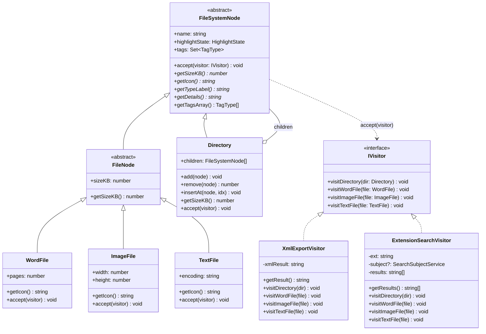
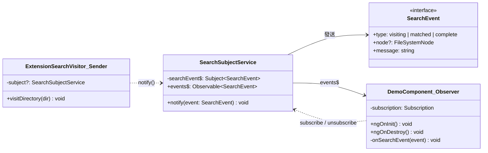
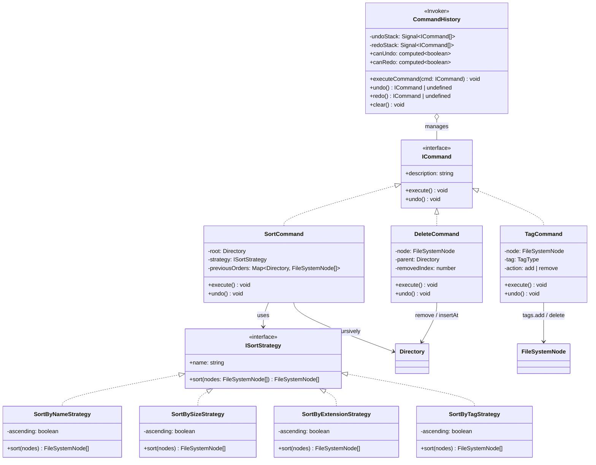
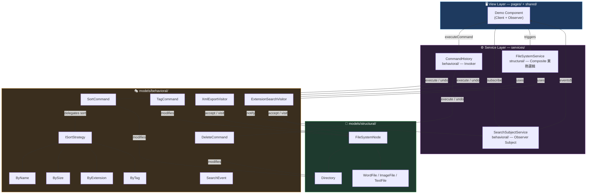

# ☁️ 雲端檔案管理系統 — Design Patterns Demo

> 以 **Angular 21** 打造的**系統分析與設計（SA&D）教學暨實作展示平台**，透過「雲端檔案管理系統」真實業務情境，深入展示 **Composite Pattern**、**Visitor Pattern**、**Observer Pattern**、**Command Pattern** 與 **Strategy Pattern** 的實務應用。

[](https://angular.dev/)
[](https://www.typescriptlang.org/)
[](https://mermaid.js.org/)
[](https://vitest.dev/)
[](LICENSE)

---

## 📖 目錄

- [專案概述](#-專案概述)
- [教學頁面導覽](#-教學頁面導覽)
- [分層架構](#-分層架構)
- [設計模式詳解](#-設計模式詳解)
  - [Composite Pattern（組合模式）](#composite-pattern組合模式)
  - [Visitor Pattern（訪問者模式）](#visitor-pattern訪問者模式)
  - [Observer Pattern（觀察者模式）](#observer-pattern觀察者模式)
  - [Command Pattern（命令模式）](#command-pattern命令模式)
  - [Strategy Pattern（策略模式）](#strategy-pattern策略模式)
- [類別架構圖](#-類別架構圖)
- [技術棧](#-技術棧)
- [快速開始](#-快速開始)
- [專案結構](#-專案結構)
- [功能展示](#-功能展示)
- [如何擴展](#-如何擴展)
- [參考資源](#-參考資源)

---

## 🎯 專案概述

本專案以 **SA&D 設計流程**（URD → Use Case → Class Diagram → Collaboration → Sequence → Architecture → 實作）為主軸，模擬一個雲端檔案管理系統，使用者可以：

- 🌲 瀏覽巢狀目錄結構（Composite Pattern）
- 📊 計算所有檔案的總容量
- 📑 將整棵目錄樹匯出為 XML 格式（Visitor Pattern）
- 🔍 依副檔名搜尋檔案（Visitor + Observer Pattern）
- 📡 搜尋時即時高亮匹配節點 + Console 顯示樹狀走訪進度（Observer Pattern）
- 🔀 多維度排序 — 依名稱、大小、副檔名、標籤，支援升冪 / 降冪（Strategy Pattern）
- 🗑️ 刪除檔案或資料夾（Command Pattern）
- 🏷️ 標籤管理 — Urgent / Work / Personal，支援多標籤（Command Pattern）
- ↩️ Undo / Redo — 所有操作皆可撤銷與重做（Command Pattern）

透過真實的業務情境來理解設計模式，而非僅止於抽象概念。

---

## 🗺️ 教學頁面導覽

本平台依 SA&D 設計流程劃分為 **7 個頁面**，每頁聚焦不同階段，並使用 **Mermaid** 互動式圖表（支援點擊放大、縮放、平移）呈現 UML 圖。

| 頁面                    | 路由             | 圖表類型                  | 說明                                                                                              |
| ----------------------- | ---------------- | ------------------------- | ------------------------------------------------------------------------------------------------- |
| 🏠 **首頁**             | `/`              | —                         | Landing Page，SA&D 流程總覽、URD 需求摘要、設計模式對應表、導覽卡片                               |
| 📋 **Use Case Diagram** | `/use-case`      | Mermaid `graph LR`        | 使用案例圖：11 個 UC、2 個 Actor、include / extend 關係                                           |
| 📐 **Class Diagram**    | `/class-diagram` | Mermaid `classDiagram`    | 5 張可展開/收合的類別圖，對應 5 大設計模式                                                        |
| 🤝 **Collaboration**    | `/collaboration` | Mermaid `graph LR`        | 2 張合作圖：搜尋流程（9 步驟）、排序流程（5 步驟），帶編號訊息傳遞                                |
| 🔄 **Sequence**         | `/sequence`      | Mermaid `sequenceDiagram` | 2 張循序圖：搜尋 `.docx` 流程、排序 + 撤銷流程，含 loop / rect 色塊區分                           |
| 🏗️ **Architecture**     | `/architecture`  | Mermaid `graph TB`        | 三層式系統架構圖：Client Layer → Application Layer → Backend（Future）                            |
| 🎮 **Live Demo**        | `/demo`          | —                         | 整合所有設計模式的互動式雲端檔案管理系統（樹狀瀏覽、搜尋、排序、刪除、標記、Undo/Redo、匯出 XML） |

> 所有 Mermaid 圖表皆使用 `MermaidDiagramComponent` 共享元件渲染，支援 **點擊放大 → 全螢幕 Modal → 滾輪縮放（25%–500%）→ 滑鼠拖曳平移 → 重置**。

---

## 🧱 分層架構

本專案採用清晰的**分層架構（Layered Architecture）**，將關注點分離至不同目錄，確保可維護性與可擴展性。

```
┌───────────────────────────────────────────────────────────────┐
│                     View Layer（pages/ + shared/）            │
│  pages/home · use-case · class-diagram · collaboration       │
│  pages/sequence · architecture · demo                        │
│  shared/mermaid-diagram（Mermaid 圖表共享元件）              │
│     UI 呈現 + 事件綁定 + Observer 訂閱 + Command 調用        │
├───────────────────────────────────────────────────────────────┤
│              Service Layer — services/（依 GoF 三大分類）     │
│                                                              │
│  🏗️ creational/（預留）                                      │
│                                                              │
│  🧱 structural/                                              │
│     file-system.service.ts    — Composite 業務邏輯           │
│       封裝建樹、計算容量、匯出 XML、搜尋等操作               │
│                                                              │
│  🎭 behavioral/                                              │
│     command-history.service.ts — Command Invoker             │
│       管理 Undo / Redo 雙堆疊（Angular Signals 驅動）        │
│     search-subject.service.ts  — Observer Subject             │
│       管理搜尋事件流（RxJS Subject → Observable）            │
├───────────────────────────────────────────────────────────────┤
│              Model Layer — models/（依 GoF 三大分類）         │
│                                                              │
│  🏗️ creational/（預留）                                      │
│                                                              │
│  🧱 structural/ — Composite Pattern                          │
│     FileSystemNode (Abstract) · FileNode (Abstract Leaf)     │
│     Directory (Composite) · WordFile · ImageFile · TextFile  │
│     TagType (Enum) · TAG_COLORS                              │
│                                                              │
│  🎭 behavioral/ — Command + Strategy + Visitor + Observer    │
│     ICommand · SortCommand · DeleteCommand · TagCommand      │
│     ISortStrategy · SortByName / Size / Extension / Tag      │
│     IVisitor · XmlExportVisitor · ExtensionSearchVisitor     │
│     SearchEvent (Observer 事件資料)                           │
└───────────────────────────────────────────────────────────────┘
```

| 層級        | 目錄                 | 職責                                                                        | 設計原則           |
| ----------- | -------------------- | --------------------------------------------------------------------------- | ------------------ |
| **View**    | `pages/` + `shared/` | 7 個教學頁面 + Mermaid 共享元件，UI 呈現 + 事件綁定                         | 關注點分離         |
| **Model**   | `models/`            | 依 GoF 三大分類（Creational / Structural / Behavioral）統一管理所有模型定義 | 單一職責、開放封閉 |
| **Service** | `services/`          | 依 GoF 三大分類封裝 @Injectable 業務邏輯（DI 注入）                         | 依賴反轉、單一職責 |

### 分層優勢

- ✅ **關注點分離**：Model（三大分類）/ Service（三大分類）/ View 各司其職
- ✅ **可測試性**：Service、Command、Strategy 可獨立進行單元測試，不依賴 DOM
- ✅ **可擴展性**：新增 Visitor、Command 或 Strategy 只需在 `models/behavioral/` 擴充
- ✅ **GoF 分類清晰**：models/ 與 services/ 皆依 Creational / Structural / Behavioral 組織
- ✅ **操作可逆**：Command Layer 讓所有操作都可以 Undo / Redo
- ✅ **Angular 最佳實踐**：使用 `inject()` + `providedIn: 'root'` + Signals 管理依賴與狀態
- ✅ **Lazy Loading**：所有頁面元件皆透過 `loadComponent()` 按需載入，優化初始載入效能

---

## 🏗 設計模式詳解

### Composite Pattern（組合模式）

> **意圖**：將物件組合成樹狀結構，使客戶端能以一致的方式處理「單一物件」與「物件群組」。

#### 問題場景

檔案系統中，**檔案**（Leaf）和**目錄**（Composite）具有不同結構，但客戶端希望統一操作它們——例如「計算大小」不需要區分是檔案還是目錄。

#### 類別角色對應

| 角色          | 類別                                | 職責                                                                                  |
| ------------- | ----------------------------------- | ------------------------------------------------------------------------------------- |
| **Component** | `FileSystemNode`                    | 抽象基類，定義統一介面 (`getSizeKB()`, `getIcon()`, `getTypeLabel()`, `getDetails()`) |
| **Leaf**      | `WordFile`, `ImageFile`, `TextFile` | 具體檔案節點，實作自身行為                                                            |
| **Composite** | `Directory`                         | 含有 `children: FileSystemNode[]`，遞迴委派操作                                       |

#### 核心程式碼

```typescript
// Component（抽象）
abstract class FileSystemNode {
  abstract getSizeKB(): number;
  abstract getIcon(): string;
  abstract getTypeLabel(): string;
  abstract getDetails(): string;
}

// Composite（目錄 — 遞迴計算）
class Directory extends FileSystemNode {
  children: FileSystemNode[] = [];

  getSizeKB(): number {
    return this.children.reduce((sum, child) => sum + child.getSizeKB(), 0);
  }
}

// Leaf（檔案 — 直接返回）
class WordFile extends FileNode {
  getSizeKB(): number {
    return this.sizeKB;
  }
}
```

#### 設計優勢

- ✅ **統一介面**：客戶端無需區分節點類型即可操作
- ✅ **開放封閉原則**：新增檔案類型（如 `PdfFile`）只需繼承，不修改現有程式碼
- ✅ **遞迴組合**：目錄可以無限巢狀

---

### Visitor Pattern（訪問者模式）

> **意圖**：在不修改既有類別的前提下，定義作用於物件結構的新操作。

#### 問題場景

若要對檔案樹執行「匯出 XML」、「搜尋副檔名」等新操作，直接在每個節點類別中添加方法將導致**類別膨脹**且違反**單一職責原則**。

#### 類別角色對應

| 角色                 | 類別                     | 職責                                                                              |
| -------------------- | ------------------------ | --------------------------------------------------------------------------------- |
| **Visitor（介面）**  | `IVisitor`               | 定義 `visitDirectory()`, `visitWordFile()`, `visitImageFile()`, `visitTextFile()` |
| **Concrete Visitor** | `XmlExportVisitor`       | 遍歷樹結構並產生 XML 字串                                                         |
| **Concrete Visitor** | `ExtensionSearchVisitor` | 依副檔名過濾並收集搜尋結果                                                        |
| **Element**          | 各 `FileSystemNode` 子類 | 實作 `accept(visitor)` — Double Dispatch                                          |

#### 核心程式碼

```typescript
// Visitor 介面
interface IVisitor {
  visitDirectory(dir: Directory): void;
  visitWordFile(file: WordFile): void;
  visitImageFile(file: ImageFile): void;
  visitTextFile(file: TextFile): void;
}

// Concrete Visitor — XML 匯出
class XmlExportVisitor implements IVisitor {
  visitDirectory(dir: Directory) {
    // 產生開標籤 → 遞迴子節點 → 產生閉標籤
    dir.children.forEach((child) => child.accept(this));
  }
  visitWordFile(file: WordFile) {
    /* 產生 XML 元素 */
  }
}

// Element — Double Dispatch
class WordFile extends FileNode {
  accept(visitor: IVisitor) {
    visitor.visitWordFile(this); // 關鍵：呼叫 Visitor 對應方法
  }
}
```

#### 設計優勢

- ✅ **開放封閉原則**：新增操作只需新建 Visitor，不改動節點類別
- ✅ **單一職責原則**：匯出邏輯與節點定義分離
- ✅ **Double Dispatch**：根據 Visitor 類型 + Element 類型決定正確行為

---

### Observer Pattern（觀察者模式）

> **意圖**：定義物件間的一對多依賴關係，當一個物件（Subject）狀態改變時，所有依賴它的物件（Observers）會自動收到通知並更新。

#### 問題場景

使用者在右側面板點下「🔍 搜尋」後，需要**同時**讓左側目錄樹即時高亮匹配節點，以及右下 Console 即時顯示樹狀走訪進度。若在 Visitor 中直接操作 UI，將導致**高度耦合**——Visitor 不應知道 UI 的存在。

#### 解決方案

```
搜尋觸發
    │
    ▼
┌──────────────────────────────┐
│  ExtensionSearchVisitor      │  ← Visitor 走訪每個節點時
│  （Visitor + 事件發送者）     │     透過 Subject 發出事件
└──────────────┬───────────────┘
               │ notify(event)
               ▼
┌──────────────────────────────┐
│  SearchSubjectService        │  ← Subject（被觀察者）
│  RxJS Subject 管理事件流     │     持有 Observer 清單
└──────────┬───────────────────┘
           │  events$
     ┌─────┴─────┐
     ▼           ▼
┌──────────┐ ┌──────────┐
│ TreeView │ │ Console  │  ← Observer（觀察者）
│ 高亮節點  │ │ 顯示進度  │     subscribe 後自動收到通知
└──────────┘ └──────────┘
```

#### 類別角色對應

| 角色                    | 類別 / 元件              | 職責                                                             |
| ----------------------- | ------------------------ | ---------------------------------------------------------------- |
| **Event（事件資料）**   | `SearchEvent`            | 定義事件類型：`visiting` / `matched` / `complete` + 攜帶節點資訊 |
| **Subject（被觀察者）** | `SearchSubjectService`   | 持有 RxJS `Subject`，提供 `notify()` 與 `events$` Observable     |
| **Observer（觀察者）**  | `Demo` Component         | 訂閱 `events$`，收到通知時更新 TreeView 高亮 & Console 進度      |
| **事件發送者**          | `ExtensionSearchVisitor` | 走訪節點時呼叫 `subject.notify()` 發出即時事件                   |

#### 核心程式碼

```typescript
// Event Model — 定義搜尋過程中的事件類型（models/search-event.model.ts）
interface SearchEvent {
  type: 'visiting' | 'matched' | 'complete';
  node?: FileSystemNode;
  message: string;
}

// Subject — 管理事件流（RxJS 天然實作 Observer Pattern）
@Injectable({ providedIn: 'root' })
class SearchSubjectService {
  private searchEvent$ = new Subject<SearchEvent>();

  get events$(): Observable<SearchEvent> {
    return this.searchEvent$.asObservable(); // 唯讀，外部只能訂閱
  }

  notify(event: SearchEvent): void {
    this.searchEvent$.next(event); // 通知所有 Observer
  }
}

// Visitor 走訪時透過 Subject 發出事件
class ExtensionSearchVisitor implements IVisitor {
  constructor(
    private ext: string,
    private subject?: SearchSubjectService,
  ) {}

  visitDirectory(dir: Directory): void {
    this.subject?.notify({ type: 'visiting', node: dir, message: `📂 進入: ${dir.name}` });
    dir.children.forEach((child) => child.accept(this));
  }
}

// Observer — Component 訂閱事件流
class Demo implements OnInit, OnDestroy {
  private subscription?: Subscription;

  ngOnInit() {
    this.subscription = this.searchSubject.events$.subscribe((event) => {
      // Observer 1：更新 TreeView 高亮
      if (event.node) event.node.highlightState = event.type === 'matched' ? 'matched' : 'visiting';
      // Observer 2：累加 Console 進度
      this.consoleLogs.push(event.message);
    });
  }

  ngOnDestroy() {
    this.subscription?.unsubscribe(); // detach — 避免記憶體洩漏
  }
}
```

#### GoF 對應 RxJS

| GoF Observer Pattern | RxJS / Angular 對應           |
| -------------------- | ----------------------------- |
| `attach(observer)`   | `subject.subscribe(callback)` |
| `detach(observer)`   | `subscription.unsubscribe()`  |
| `notify()`           | `subject.next(event)`         |
| Observer 介面        | `subscribe()` 的 callback     |

#### 設計優勢

- ✅ **鬆耦合**：Visitor 不知道 UI 的存在，只透過 Subject 發送事件
- ✅ **一對多通知**：一個事件同時驅動多個 UI 區域（TreeView + Console）
- ✅ **可擴展**：未來新增 Observer（如 StatusBar、Notification）不需修改 Subject
- ✅ **RxJS 天然整合**：Angular 生態中 Observable/Subject 即是 Observer Pattern 的最佳實踐

---

### Command Pattern（命令模式）

> **意圖**：將操作封裝為物件，使得可以對操作進行參數化、佇列化、記錄、以及撤銷 / 重做。

#### 問題場景

使用者對檔案樹執行「排序」、「刪除」、「標籤」等操作後，希望能隨時**撤銷（Undo）**或**重做（Redo）**。若在 Component 中直接修改資料，將導致無法追蹤操作歷史，也無法實現 Undo/Redo。

#### 解決方案

```
使用者操作（排序 / 刪除 / 標籤）
    │
    ▼
┌──────────────────────────────────┐
│  Demo Component（Client）        │  ← 根據使用者動作建立 Command 物件
│  建立 Concrete Command           │
└──────────────┬───────────────────┘
               │ executeCommand(cmd)
               ▼
┌──────────────────────────────────┐
│  CommandHistory（Invoker）       │  ← 執行命令 + 管理 Undo/Redo 堆疊
│  undoStack ← [cmd1, cmd2, ...]  │
│  redoStack ← [cmd3, ...]        │
└──────────────┬───────────────────┘
               │ cmd.execute() / cmd.undo()
               ▼
┌──────────────────────────────────┐
│  Concrete Commands               │
│  ┌────────────────────────────┐  │
│  │ SortCommand                │  │  ← 保存排序前快照，undo 還原順序
│  ├────────────────────────────┤  │
│  │ DeleteCommand              │  │  ← 保存被刪位置，undo 插回原處
│  ├────────────────────────────┤  │
│  │ TagCommand                 │  │  ← 記錄 add/remove，undo 反向操作
│  └────────────────────────────┘  │
└──────────────────────────────────┘
```

#### 類別角色對應

| 角色                   | 類別 / 元件                   | 職責                                                                    |
| ---------------------- | ----------------------------- | ----------------------------------------------------------------------- |
| **Command（介面）**    | `ICommand`                    | 定義 `execute()`, `undo()`, `description` 統一介面                      |
| **Concrete Command**   | `SortCommand`                 | 封裝排序操作，保存排序前的快照以支援 undo                               |
| **Concrete Command**   | `DeleteCommand`               | 封裝刪除操作，記錄被刪節點的 parent + index                             |
| **Concrete Command**   | `TagCommand`                  | 封裝標籤操作（add/remove），undo 時反向操作                             |
| **Invoker（調用者）**  | `CommandHistory`              | 管理 undoStack / redoStack，提供 `executeCommand()`, `undo()`, `redo()` |
| **Client（客戶端）**   | `Demo` Component              | 根據使用者操作建立 Command 物件，交給 Invoker 執行                      |
| **Receiver（接收者）** | `Directory`, `FileSystemNode` | 實際被操作的領域物件                                                    |

#### 核心程式碼

```typescript
// Command 介面 — 所有操作的統一契約
interface ICommand {
  execute(): void;
  undo(): void;
  readonly description: string;
}

// Invoker — 管理命令歷史（Angular Signal 驅動 UI 更新）
@Injectable({ providedIn: 'root' })
class CommandHistory {
  private undoStack = signal<ICommand[]>([]);
  private redoStack = signal<ICommand[]>([]);

  canUndo = computed(() => this.undoStack().length > 0);
  canRedo = computed(() => this.redoStack().length > 0);

  executeCommand(command: ICommand): void {
    command.execute();
    this.undoStack.update((s) => [...s, command]);
    this.redoStack.set([]); // 新操作清空 redo 分支
  }

  undo(): ICommand | undefined {
    const stack = this.undoStack();
    if (stack.length === 0) return undefined;
    const cmd = stack[stack.length - 1];
    cmd.undo();
    this.undoStack.set(stack.slice(0, -1));
    this.redoStack.update((r) => [...r, cmd]);
    return cmd;
  }

  redo(): ICommand | undefined {
    const redo = this.redoStack();
    if (redo.length === 0) return undefined;
    const cmd = redo[redo.length - 1];
    cmd.execute();
    this.redoStack.set(redo.slice(0, -1));
    this.undoStack.update((u) => [...u, cmd]);
    return cmd;
  }
}

// Concrete Command — 刪除（保存位置以支援 undo）
class DeleteCommand implements ICommand {
  private removedIndex = -1;

  constructor(
    private node: FileSystemNode,
    private parent: Directory,
  ) {}

  execute(): void {
    this.removedIndex = this.parent.remove(this.node);
  }
  undo(): void {
    this.parent.insertAt(this.node, this.removedIndex);
  }
}

// Client — Component 建立並執行命令
class Demo {
  private commandHistory = inject(CommandHistory);

  deleteSelected(): void {
    const cmd = new DeleteCommand(selectedNode, parentDir);
    this.commandHistory.executeCommand(cmd);
  }

  undo(): void {
    this.commandHistory.undo();
  }
  redo(): void {
    this.commandHistory.redo();
  }
}
```

#### Undo / Redo 堆疊運作流程

```
操作序列：Sort → Delete → Tag

          undoStack              redoStack
Sort   → [Sort]                 []
Delete → [Sort, Delete]         []
Tag    → [Sort, Delete, Tag]    []

Undo   → [Sort, Delete]         [Tag]
Undo   → [Sort]                 [Tag, Delete]
Redo   → [Sort, Delete]         [Tag]

新操作  → [Sort, Delete, NewCmd] []    ← redo 分支清空
```

#### 設計優勢

- ✅ **操作可逆**：每個 Command 自行管理 execute/undo 邏輯
- ✅ **統一介面**：Invoker 不需知道具體操作類型，只呼叫 ICommand
- ✅ **歷史記錄**：undoStack / redoStack 完整追蹤操作順序
- ✅ **可擴展**：新增操作只需新建 Command 類別，不修改 Invoker
- ✅ **Signal 驅動**：`canUndo` / `canRedo` 為 computed signal，UI 自動更新按鈕狀態

---

### Strategy Pattern（策略模式）

> **意圖**：定義一系列演算法，將每個演算法封裝起來，使它們可以互相替換。讓演算法的變化獨立於使用它的客戶端。

#### 問題場景

檔案排序需要支援**多種維度**（名稱、大小、副檔名、標籤）以及**升冪 / 降冪**。若在 Component 中用 `if-else` 或 `switch` 判斷排序方式，將導致**條件邏輯膨脹**且違反**開放封閉原則**。

#### 解決方案

```
使用者選擇排序方式
    │
    ├── 依名稱 → SortByNameStrategy
    ├── 依大小 → SortBySizeStrategy
    ├── 依類型 → SortByExtensionStrategy
    └── 依標籤 → SortByTagStrategy
                    │
                    ▼
            ┌──────────────────┐
            │ ISortStrategy    │  ← 統一介面
            │ + name: string   │
            │ + sort(nodes)    │
            └──────────────────┘
                    │
                    ▼
            ┌──────────────────┐
            │ SortCommand      │  ← Context：持有策略並委派排序
            │ + strategy       │
            │ + execute()      │
            └──────────────────┘
```

#### 類別角色對應

| 角色                  | 類別                      | 職責                                            |
| --------------------- | ------------------------- | ----------------------------------------------- |
| **Strategy（介面）**  | `ISortStrategy`           | 定義 `name` + `sort(nodes)` 統一介面            |
| **Concrete Strategy** | `SortByNameStrategy`      | 依名稱字典序排序，支援升冪 / 降冪               |
| **Concrete Strategy** | `SortBySizeStrategy`      | 依檔案大小（KB）排序，支援升冪 / 降冪           |
| **Concrete Strategy** | `SortByExtensionStrategy` | 依副檔名排序（目錄排最前），支援升冪 / 降冪     |
| **Concrete Strategy** | `SortByTagStrategy`       | 依標籤數量排序，支援升冪 / 降冪                 |
| **Context（使用者）** | `SortCommand`             | 持有 ISortStrategy，在 execute() 中委派排序邏輯 |

#### 核心程式碼

```typescript
// Strategy 介面
interface ISortStrategy {
  readonly name: string;
  sort(nodes: FileSystemNode[]): FileSystemNode[];
}

// Concrete Strategy — 依名稱排序
class SortByNameStrategy implements ISortStrategy {
  constructor(private ascending = true) {}

  get name() { return `名稱${this.ascending ? '升冪 ↑' : '降冪 ↓'}`; }

  sort(nodes: FileSystemNode[]): FileSystemNode[] {
    return [...nodes].sort((a, b) => {
      const result = a.name.localeCompare(b.name, 'zh-Hant');
      return this.ascending ? result : -result;
    });
  }
}

// Concrete Strategy — 依副檔名排序（目錄優先）
class SortByExtensionStrategy implements ISortStrategy {
  sort(nodes: FileSystemNode[]): FileSystemNode[] {
    return [...nodes].sort((a, b) => {
      const extA = a instanceof Directory ? '' : this.getExtension(a);
      const extB = b instanceof Directory ? '' : this.getExtension(b);
      return extA.localeCompare(extB);
    });
  }
}

// Context — SortCommand 持有策略
class SortCommand implements ICommand {
  private previousOrders = new Map<Directory, FileSystemNode[]>();

  constructor(private root: Directory, private strategy: ISortStrategy) {}

  execute(): void {
    this.previousOrders.clear();
    this.sortRecursive(this.root);
  }

  undo(): void {
    for (const [dir, original] of this.previousOrders) {
      dir.children = [...original];
    }
  }
}

// Client — Component 建立策略並注入 Command
sortBy(type: 'name' | 'size' | 'extension' | 'tag'): void {
  const strategies = {
    name: new SortByNameStrategy(this.sortAscending()),
    size: new SortBySizeStrategy(this.sortAscending()),
    extension: new SortByExtensionStrategy(this.sortAscending()),
    tag: new SortByTagStrategy(this.sortAscending()),
  };
  const cmd = new SortCommand(this.root, strategies[type]);
  this.commandHistory.executeCommand(cmd);
}
```

#### Strategy × Command 協作

```
┌─────────────┐    建立    ┌──────────────┐    委派    ┌───────────────────┐
│ Demo(Client)│ ─────────▶ │ SortCommand  │ ─────────▶ │ ISortStrategy     │
│ sortBy()    │            │ (Command)    │            │ .sort(children)   │
└─────────────┘            └──────┬───────┘            └───────────────────┘
                                  │
                           executeCommand()
                                  │
                                  ▼
                           ┌──────────────┐
                           │CommandHistory │
                           │  (Invoker)   │
                           └──────────────┘
```

> **Command** 負責「何時執行 + 如何撤銷」，**Strategy** 負責「如何排序」——兩個模式各司其職，互不侵犯。

#### 設計優勢

- ✅ **消除條件分支**：不再需要 if-else 判斷排序類型
- ✅ **開放封閉原則**：新增排序方式只需新建 Strategy 類別
- ✅ **可組合**：Strategy 注入 Command，Command 注入 Invoker，層層組合
- ✅ **單一職責**：每個 Strategy 只負責一種排序演算法
- ✅ **可獨立測試**：Strategy 是純函式，不依賴 Angular 或 DOM

---

## 📐 類別架構圖

### Composite + Visitor Pattern



### Observer Pattern



### Command + Strategy Pattern



### 全域互動關係總覽



---

## 🛠 技術棧

| 技術                | 版本   | 用途                                                                       |
| ------------------- | ------ | -------------------------------------------------------------------------- |
| **Angular**         | 21.1.x | 前端框架（Standalone Components）                                          |
| **TypeScript**      | 5.9    | 強型別語言                                                                 |
| **RxJS**            | 7.8    | 響應式程式設計（Observer Pattern）                                         |
| **Angular Signals** | —      | 狀態管理（取代傳統 Zone.js 變更偵測）                                      |
| **Mermaid**         | 11.12  | UML 圖表渲染（Use Case / Class / Sequence / Collaboration / Architecture） |
| **Vitest**          | 4.0    | 單元測試框架                                                               |
| **SCSS**            | —      | 樣式預處理（GitHub Dark Theme）                                            |

### Angular 現代特性使用

- ✅ `ChangeDetectionStrategy.OnPush` + Signals
- ✅ 新版控制流語法 `@if` / `@for`
- ✅ Standalone Component（無需 NgModule）
- ✅ `input.required<T>()` 強制型別輸入
- ✅ `afterNextRender()` SSR 安全的 DOM 操作
- ✅ Lazy Loading Routes（`loadComponent()`）
- ✅ `inject()` 函式式依賴注入

---

## 🚀 快速開始

### 前置需求

- **Node.js** ≥ 20.x
- **npm** ≥ 11.x

### 安裝與啟動

```bash
# 1. Clone 專案
git clone https://github.com/Sean11133/XD.git
cd design-pattern

# 2. 安裝依賴
npm install

# 3. 啟動開發伺服器
npm start
```

應用程式將在 `http://localhost:4200/XD` 啟動。

### 其他指令

```bash
npm run build    # 建置生產版本（輸出至 docs/）
npm run test     # 執行單元測試（Vitest）
npm run watch    # 開發模式 Watch Build
```

---

## 📁 專案結構

```
design-pattern/
├── src/
│   ├── app/
│   │   ├── models/                              # 🏗 Model 層（依 GoF 三大分類）
│   │   │   ├── creational/                       #   🏗️ 建立型模式（預留）
│   │   │   │   └── index.ts                      #     Barrel export
│   │   │   ├── structural/                       #   🧱 結構型模式 — Composite Pattern
│   │   │   │   ├── file-system-node.model.ts     #     FileSystemNode + FileNode 抽象基類
│   │   │   │   ├── directory.model.ts            #     Directory (Composite)
│   │   │   │   ├── word-file.model.ts            #     WordFile (Leaf)
│   │   │   │   ├── image-file.model.ts           #     ImageFile (Leaf)
│   │   │   │   ├── text-file.model.ts            #     TextFile (Leaf)
│   │   │   │   ├── tag.model.ts                  #     TagType enum + TAG_COLORS
│   │   │   │   └── index.ts                      #     Barrel export
│   │   │   ├── behavioral/                       #   🎭 行為型模式
│   │   │   │   ├── visitor.interface.ts           #     IVisitor 介面（Visitor Pattern）
│   │   │   │   ├── xml-export.visitor.ts          #     XML 匯出 Visitor
│   │   │   │   ├── extension-search.visitor.ts    #     副檔名搜尋 Visitor（+ Observer）
│   │   │   │   ├── command.interface.ts           #     ICommand 介面（Command Pattern）
│   │   │   │   ├── delete.command.ts              #     DeleteCommand
│   │   │   │   ├── sort.command.ts                #     SortCommand
│   │   │   │   ├── tag.command.ts                 #     TagCommand
│   │   │   │   ├── sort-strategy.interface.ts     #     ISortStrategy 介面（Strategy Pattern）
│   │   │   │   ├── sort-by-name.strategy.ts       #     依名稱排序
│   │   │   │   ├── sort-by-size.strategy.ts       #     依大小排序
│   │   │   │   ├── sort-by-extension.strategy.ts  #     依副檔名排序
│   │   │   │   ├── sort-by-tag.strategy.ts        #     依標籤排序
│   │   │   │   ├── search-event.model.ts          #     SearchEvent（Observer Pattern）
│   │   │   │   └── index.ts                      #     Barrel export
│   │   │   └── index.ts                          #   主 Barrel export（三大分類彙整）
│   │   │
│   │   ├── services/                             # ⚙️ Service 層（依 GoF 三大分類）
│   │   │   ├── creational/                       #   🏗️ 建立型模式（預留）
│   │   │   │   └── index.ts                      #     Barrel export
│   │   │   ├── structural/                       #   🧱 結構型模式
│   │   │   │   ├── file-system.service.ts        #     Composite — 檔案樹建構與業務邏輯
│   │   │   │   └── index.ts                      #     Barrel export
│   │   │   ├── behavioral/                       #   🎭 行為型模式
│   │   │   │   ├── command-history.service.ts     #     Command — Undo/Redo 歷史管理
│   │   │   │   ├── search-subject.service.ts      #     Observer — 搜尋事件 Subject
│   │   │   │   └── index.ts                      #     Barrel export
│   │   │   └── index.ts                          #   主 Barrel export（三大分類彙整）
│   │   │
│   │   ├── pages/                                # 📄 教學頁面（Lazy Loading）
│   │   │   ├── home/                             #   🏠 首頁 — SA&D 流程總覽 + 導覽
│   │   │   ├── use-case/                         #   📋 Use Case Diagram（Mermaid）
│   │   │   ├── class-diagram/                    #   📐 Class Diagram × 5（Mermaid）
│   │   │   ├── collaboration/                    #   🤝 Collaboration Diagram × 2（Mermaid）
│   │   │   ├── sequence/                         #   🔄 Sequence Diagram × 2（Mermaid）
│   │   │   ├── architecture/                     #   🏗️ Architecture Diagram（Mermaid）
│   │   │   └── demo/                             #   🎮 Live Demo — 整合 5 大設計模式
│   │   │
│   │   ├── shared/                               # 🔧 共享元件
│   │   │   └── mermaid-diagram/                  #   Mermaid 圖表渲染元件（點擊放大 + 縮放 + 平移）
│   │   │
│   │   ├── app.ts                                # 🧭 Root Component（導覽列 + Router Outlet）
│   │   ├── app.html                              # 📄 Root Template
│   │   ├── app.scss                              # 🎨 Root Styles
│   │   ├── app.config.ts                         # Angular 應用設定
│   │   ├── app.routes.ts                         # 路由設定（7 頁 Lazy Loading）
│   │   └── app.spec.ts                           # 單元測試
│   │
│   ├── main.ts                                   # 應用進入點
│   ├── index.html                                # 主頁 HTML
│   └── styles.scss                               # 全域樣式（Dark Theme）
│
├── docs/                                         # 建置輸出（GitHub Pages）
├── angular.json                                  # Angular CLI 設定
├── package.json                                  # 依賴管理
├── tsconfig.json                                 # TypeScript 設定
└── README.md                                     # 本文件
```

---

## 🎮 功能展示

| 功能                     | 使用的模式         | 說明                                                         |
| ------------------------ | ------------------ | ------------------------------------------------------------ |
| 📊 **計算總容量**        | Composite          | 遞迴加總所有子節點的 `getSizeKB()`                           |
| 📑 **匯出 XML**          | Visitor            | `XmlExportVisitor` 遍歷樹並生成 XML                          |
| 🔍 **副檔名搜尋**        | Visitor + Observer | `ExtensionSearchVisitor` 走訪時透過 Subject 即時發送事件     |
| 🌲 **目錄樹顯示**        | Composite          | Angular Template 遞迴渲染巢狀結構                            |
| ✨ **搜尋即時高亮**      | Observer           | 節點 `highlightState` 隨事件更新，TreeView 即時反映          |
| 📡 **Console 走訪進度**  | Observer           | 訂閱事件流，逐行顯示 Visitor 的樹狀走訪軌跡                  |
| 🔀 **多維度排序**        | Command + Strategy | 四種 Strategy（名稱 / 大小 / 副檔名 / 標籤）注入 SortCommand |
| 🗑️ **刪除檔案 / 資料夾** | Command            | `DeleteCommand` 保存位置，undo 時插回原處                    |
| 🏷️ **標籤管理**          | Command            | `TagCommand` 支援 add/remove，三種標籤可多重貼               |
| ↩️ **Undo / Redo**       | Command            | `CommandHistory` 管理雙堆疊，所有操作皆可撤銷重做            |
| 📐 **UML 圖表**          | Mermaid            | 5 種 UML 圖表，支援點擊放大、縮放（25%–500%）、平移          |

---

## 🔄 如何擴展

### 新增檔案類型（不違反 OCP）

```typescript
// 1. 在 models/structural/ 新增 pdf-file.model.ts
export class PdfFile extends FileNode {
  constructor(
    name: string,
    sizeKB: number,
    public pages: number,
  ) {
    super(name, sizeKB);
  }
  getIcon() {
    return '📕';
  }
  getTypeLabel() {
    return '[PDF 檔案]';
  }
  getDetails() {
    return `(頁數: ${this.pages}, 大小: ${this.sizeKB}KB)`;
  }
  accept(visitor: IVisitor) {
    visitor.visitPdfFile(this);
  }
}

// 2. 在 models/behavioral/visitor.interface.ts 新增 visitPdfFile() 方法
// 3. 在 models/behavioral/ 各 Visitor 實作中新增對應邏輯
// 4. 在 models/index.ts 匯出新類別
```

### 新增操作（不修改節點類別）

```typescript
// 在 models/behavioral/ 新建 size-report.visitor.ts 即可
export class SizeReportVisitor implements IVisitor {
  // 實作各 visit 方法，產生大小報告
}

// 在 services/structural/file-system.service.ts 新增呼叫方法
// Component 層只需在 demo.ts 新增按鈕綁定
```

### 新增排序方式（不修改既有程式碼）

```typescript
// 在 models/behavioral/ 新建 sort-by-date.strategy.ts
export class SortByDateStrategy implements ISortStrategy {
  readonly name = '依日期排序';
  sort(nodes: FileSystemNode[]): FileSystemNode[] {
    // 實作排序邏輯
  }
}

// 在 Demo Component 的 sortBy() 方法中新增選項即可
```

---

## 📚 參考資源

- [Refactoring Guru — Composite Pattern](https://refactoring.guru/design-patterns/composite)
- [Refactoring Guru — Visitor Pattern](https://refactoring.guru/design-patterns/visitor)
- [Refactoring Guru — Observer Pattern](https://refactoring.guru/design-patterns/observer)
- [Refactoring Guru — Command Pattern](https://refactoring.guru/design-patterns/command)
- [Refactoring Guru — Strategy Pattern](https://refactoring.guru/design-patterns/strategy)
- [Angular Official Documentation](https://angular.dev/)
- [RxJS — Subject](https://rxjs.dev/guide/subject)
- [Mermaid Official Documentation](https://mermaid.js.org/)

---

## 📝 License

This project is licensed under the **MIT License**.
