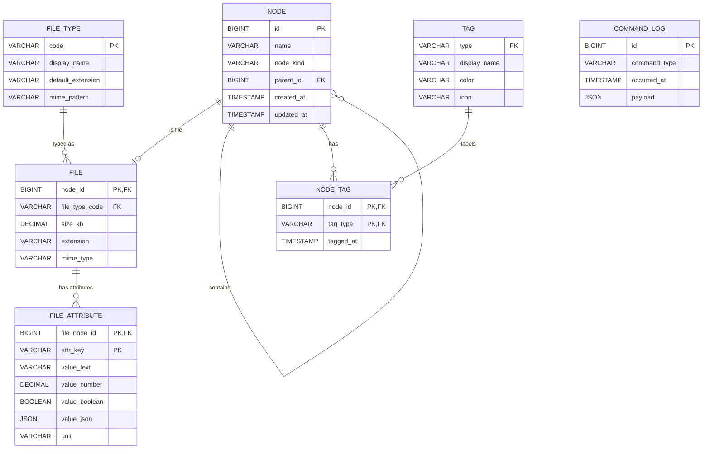

# ER Model 設計（可擴充檔案型別版）

> 本版本改為「新增檔案型別不需新增資料表」設計。
> 核心做法：以 `FILE` 儲存共同欄位，型別差異放入 `FILE_ATTRIBUTE`（Key-Value）。

## 1) ER Diagram（Mermaid）

## 2) 設計對應說明

- `NODE`：統一節點（目錄/檔案），以 `node_kind` 區分（`directory` / `file`）。
- `FILE`：只放「所有檔案共通欄位」，如 `size_kb`、`extension`、`mime_type`、`file_type_code`。
- `FILE_ATTRIBUTE`：存各型別差異欄位（例如 pages、width、height、encoding），新增檔案型別時不需改 schema。
- `FILE_TYPE`：檔案型別字典（`word`、`image`、`text`、未來 `pdf`、`video`...）。
- `NODE.parent_id`：Adjacency List 表示 Composite 樹狀結構。
- `TAG` + `NODE_TAG`：對應 `TagMediator` 多對多索引。
- `COMMAND_LOG`：保存 Command 歷史以支援稽核與重播。

## 3) Data Dictionary

### 3.1 NODE

| 欄位         | 型別      | 約束                                    | 說明                    |
| ------------ | --------- | --------------------------------------- | ----------------------- |
| `id`         | BIGINT    | PK, NOT NULL                            | 節點唯一識別碼          |
| `name`       | VARCHAR   | NOT NULL                                | 節點名稱                |
| `node_kind`  | VARCHAR   | NOT NULL, CHECK IN (`directory`,`file`) | 節點種類                |
| `parent_id`  | BIGINT    | FK -> `NODE.id`, NULLABLE               | 父節點；根節點為 `NULL` |
| `created_at` | TIMESTAMP | NOT NULL                                | 建立時間                |
| `updated_at` | TIMESTAMP | NOT NULL                                | 最後更新時間            |

### 3.2 FILE_TYPE

| 欄位                | 型別    | 約束         | 說明                                 |
| ------------------- | ------- | ------------ | ------------------------------------ |
| `code`              | VARCHAR | PK, NOT NULL | 型別代碼（`word`、`image`、`text`…） |
| `display_name`      | VARCHAR | NOT NULL     | 顯示名稱                             |
| `default_extension` | VARCHAR | NULLABLE     | 預設副檔名                           |
| `mime_pattern`      | VARCHAR | NULLABLE     | MIME 規則（如 `image/*`）            |

### 3.3 FILE

| 欄位             | 型別    | 約束                             | 說明                                   |
| ---------------- | ------- | -------------------------------- | -------------------------------------- |
| `node_id`        | BIGINT  | PK, FK -> `NODE.id`              | 檔案節點 ID（`NODE.node_kind = file`） |
| `file_type_code` | VARCHAR | FK -> `FILE_TYPE.code`, NOT NULL | 檔案型別                               |
| `size_kb`        | DECIMAL | NOT NULL, CHECK >= 0             | 檔案大小（KB）                         |
| `extension`      | VARCHAR | NOT NULL                         | 副檔名（例如 `docx`、`png`）           |
| `mime_type`      | VARCHAR | NULLABLE                         | MIME Type                              |

### 3.4 FILE_ATTRIBUTE

| 欄位            | 型別    | 約束                     | 說明                                                  |
| --------------- | ------- | ------------------------ | ----------------------------------------------------- |
| `file_node_id`  | BIGINT  | PK, FK -> `FILE.node_id` | 檔案節點 ID                                           |
| `attr_key`      | VARCHAR | PK, NOT NULL             | 屬性鍵（例如 `pages`、`width`、`height`、`encoding`） |
| `value_text`    | VARCHAR | NULLABLE                 | 文字值                                                |
| `value_number`  | DECIMAL | NULLABLE                 | 數值                                                  |
| `value_boolean` | BOOLEAN | NULLABLE                 | 布林值                                                |
| `value_json`    | JSON    | NULLABLE                 | 複合值                                                |
| `unit`          | VARCHAR | NULLABLE                 | 單位（例如 `px`）                                     |

> 建議加上 `CHECK`：`value_text` / `value_number` / `value_boolean` / `value_json` 至少一欄非 NULL。

### 3.5 TAG

| 欄位           | 型別    | 約束         | 說明                                       |
| -------------- | ------- | ------------ | ------------------------------------------ |
| `type`         | VARCHAR | PK, NOT NULL | 標籤鍵值（`urgent` / `work` / `personal`） |
| `display_name` | VARCHAR | NOT NULL     | 顯示名稱                                   |
| `color`        | VARCHAR | NOT NULL     | 顏色代碼                                   |
| `icon`         | VARCHAR | NOT NULL     | 圖示字元                                   |

### 3.6 NODE_TAG

| 欄位        | 型別      | 約束                 | 說明     |
| ----------- | --------- | -------------------- | -------- |
| `node_id`   | BIGINT    | PK, FK -> `NODE.id`  | 節點 ID  |
| `tag_type`  | VARCHAR   | PK, FK -> `TAG.type` | 標籤類型 |
| `tagged_at` | TIMESTAMP | NOT NULL             | 標記時間 |

### 3.7 COMMAND_LOG

| 欄位           | 型別      | 約束         | 說明                                               |
| -------------- | --------- | ------------ | -------------------------------------------------- |
| `id`           | BIGINT    | PK, NOT NULL | 日誌 ID                                            |
| `command_type` | VARCHAR   | NOT NULL     | 命令型別（Sort/Delete/Tag/Copy/Paste/RestoreSort） |
| `occurred_at`  | TIMESTAMP | NOT NULL     | 操作時間                                           |
| `payload`      | JSON      | NOT NULL     | 命令參數與快照                                     |

## 4) 使用範例（重點）

- Word：`FILE.file_type_code='word'`，`FILE_ATTRIBUTE` 存 `pages=15`
- Image：`FILE.file_type_code='image'`，`FILE_ATTRIBUTE` 存 `width=1920`、`height=1080`
- Text：`FILE.file_type_code='text'`，`FILE_ATTRIBUTE` 存 `encoding='UTF-8'`
- 未來新增 `pdf`：只要在 `FILE_TYPE` 加一筆 `pdf`，再以 `FILE_ATTRIBUTE` 存 `page_count`、`is_scanned`，**不需新增資料表**

## 5) 建議索引

- `NODE(parent_id)`：加速樹狀查詢。
- `NODE(node_kind)`：加速目錄/檔案過濾。
- `FILE(file_type_code)`：加速型別查詢。
- `FILE(extension)`：加速副檔名搜尋。
- `FILE_ATTRIBUTE(file_node_id, attr_key)`：加速屬性讀取。
- `NODE_TAG(tag_type)`：加速標籤反查。
- `COMMAND_LOG(occurred_at)`：加速時間序檢索。
