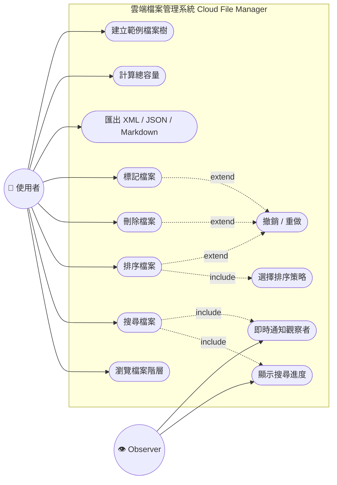
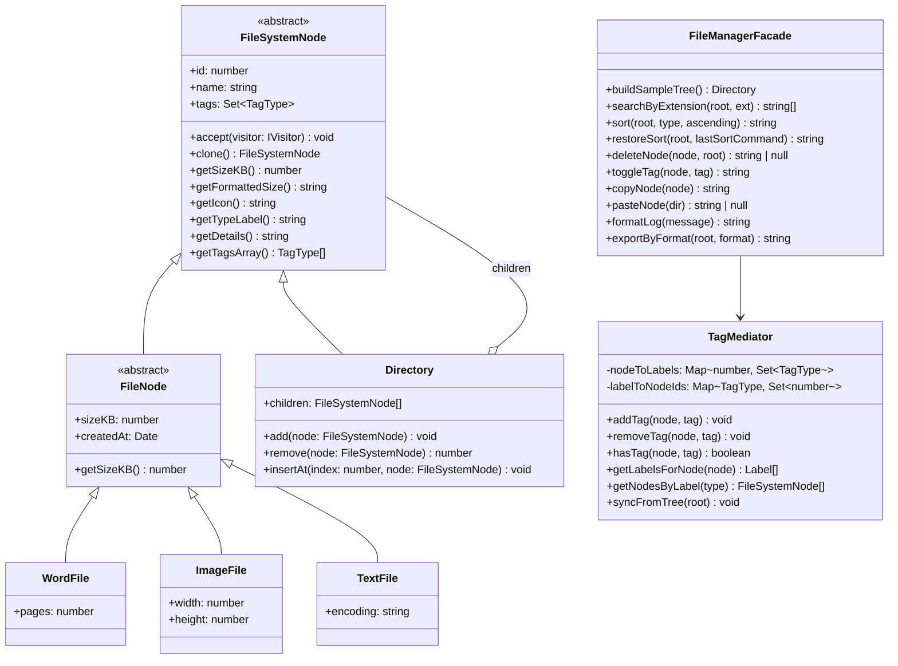
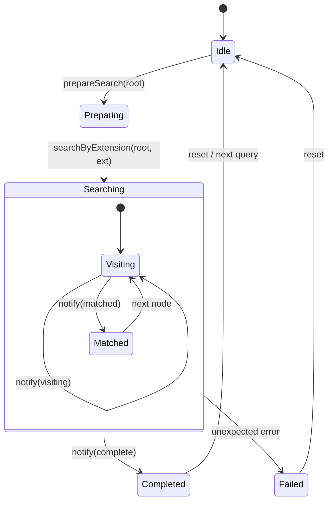
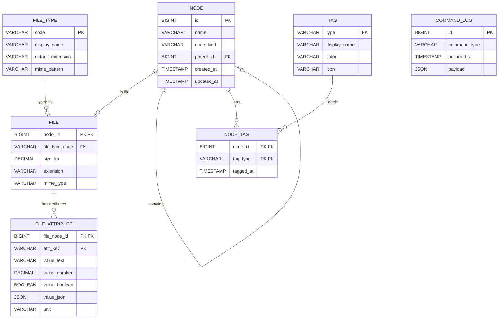
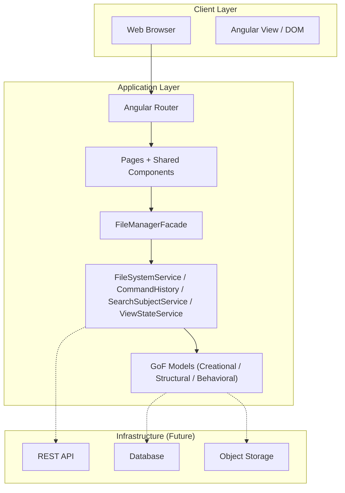
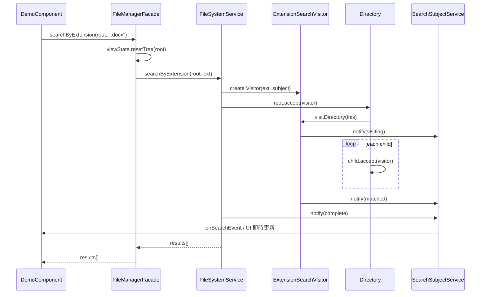
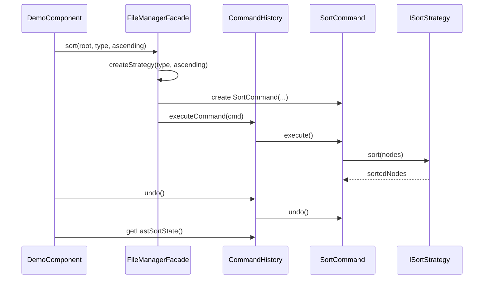
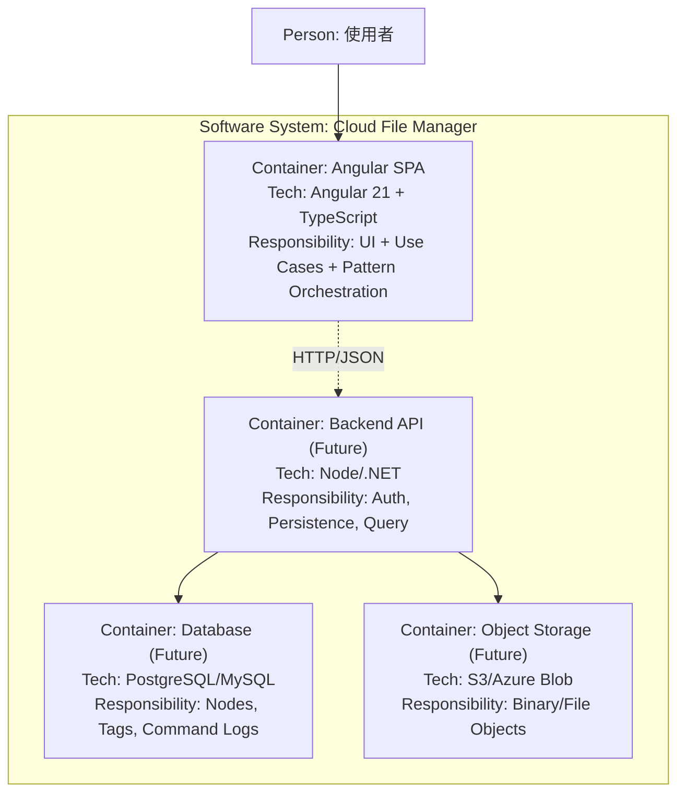
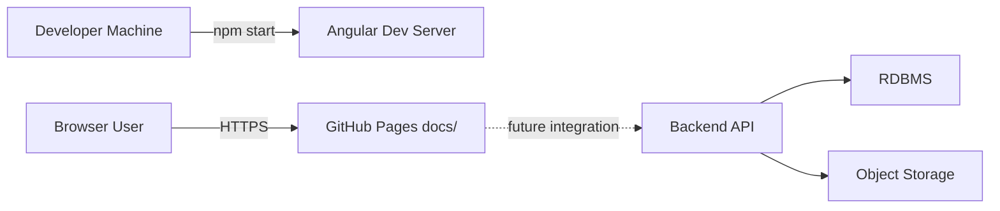

# 雲端檔案管理系統規格書（Spec）

## 1. 文件目的與範圍

本文件定義「雲端檔案管理系統（Cloud File Manager）」之前端應用規格，涵蓋：

- 功能需求（Use Case）
- Domain Model（Class Diagram）
- 狀態流轉（State Diagram）
- 資料模型（ER Diagram + Data Dictionary）
- 關鍵流程（Sequence Diagram）
- 架構與部署（Clean Architecture + C4 Container）

> 註：目前專案為 Angular SPA，尚未接入後端 API。ER 模型為可持久化設計基礎。

---

## 2. 系統邊界與角色

### 2.1 系統邊界

- 系統名稱：雲端檔案管理系統（Cloud File Manager）
- 邊界內：檔案樹瀏覽、搜尋、排序、標籤、複製貼上、匯出、Undo/Redo、事件通知與儀表板統計
- 邊界外：真實檔案儲存、身份驗證、資料庫落地、跨裝置同步

### 2.2 角色

- 主要角色（Primary Actor）：使用者
- 次要角色（Secondary Actor）：Observer（Console / Dashboard / UI 訂閱者）

---

## 3. Use Case Diagram（必要）

---

## 4. 類別圖（Domain Model，必要）

---

## 5. 狀態圖（必要）

> 下圖描述「搜尋流程 + UI 呈現」的狀態變化。

---

## 6. ER Diagram（必要：Table Schema）

---

## 7. Data Dictionary（必要）

### 7.1 NODE

| 欄位         | 型別      | 約束                                    | 說明                    |
| ------------ | --------- | --------------------------------------- | ----------------------- |
| `id`         | BIGINT    | PK, NOT NULL                            | 節點唯一識別碼          |
| `name`       | VARCHAR   | NOT NULL                                | 節點名稱                |
| `node_kind`  | VARCHAR   | NOT NULL, CHECK IN (`directory`,`file`) | 節點種類                |
| `parent_id`  | BIGINT    | FK -> `NODE.id`, NULLABLE               | 父節點；根節點為 `NULL` |
| `created_at` | TIMESTAMP | NOT NULL                                | 建立時間                |
| `updated_at` | TIMESTAMP | NOT NULL                                | 最後更新時間            |

### 7.2 FILE_TYPE

| 欄位                | 型別    | 約束         | 說明                                 |
| ------------------- | ------- | ------------ | ------------------------------------ |
| `code`              | VARCHAR | PK, NOT NULL | 型別代碼（`word`、`image`、`text`…） |
| `display_name`      | VARCHAR | NOT NULL     | 顯示名稱                             |
| `default_extension` | VARCHAR | NULLABLE     | 預設副檔名                           |
| `mime_pattern`      | VARCHAR | NULLABLE     | MIME 規則                            |

### 7.3 FILE

| 欄位             | 型別    | 約束                             | 說明                                   |
| ---------------- | ------- | -------------------------------- | -------------------------------------- |
| `node_id`        | BIGINT  | PK, FK -> `NODE.id`              | 檔案節點 ID（`NODE.node_kind = file`） |
| `file_type_code` | VARCHAR | FK -> `FILE_TYPE.code`, NOT NULL | 檔案型別                               |
| `size_kb`        | DECIMAL | NOT NULL, CHECK >= 0             | 檔案大小（KB）                         |
| `extension`      | VARCHAR | NOT NULL                         | 副檔名                                 |
| `mime_type`      | VARCHAR | NULLABLE                         | MIME Type                              |

### 7.4 FILE_ATTRIBUTE

| 欄位            | 型別    | 約束                     | 說明                                                  |
| --------------- | ------- | ------------------------ | ----------------------------------------------------- |
| `file_node_id`  | BIGINT  | PK, FK -> `FILE.node_id` | 檔案節點 ID                                           |
| `attr_key`      | VARCHAR | PK, NOT NULL             | 屬性鍵（例如 `pages`、`width`、`height`、`encoding`） |
| `value_text`    | VARCHAR | NULLABLE                 | 文字值                                                |
| `value_number`  | DECIMAL | NULLABLE                 | 數值                                                  |
| `value_boolean` | BOOLEAN | NULLABLE                 | 布林值                                                |
| `value_json`    | JSON    | NULLABLE                 | 複合值                                                |
| `unit`          | VARCHAR | NULLABLE                 | 單位（例如 `px`）                                     |

### 7.5 TAG

| 欄位           | 型別    | 約束         | 說明                                       |
| -------------- | ------- | ------------ | ------------------------------------------ |
| `type`         | VARCHAR | PK, NOT NULL | 標籤鍵值（`urgent` / `work` / `personal`） |
| `display_name` | VARCHAR | NOT NULL     | 顯示名稱                                   |
| `color`        | VARCHAR | NOT NULL     | 顏色代碼                                   |
| `icon`         | VARCHAR | NOT NULL     | 圖示                                       |

### 7.6 NODE_TAG

| 欄位        | 型別      | 約束                 | 說明     |
| ----------- | --------- | -------------------- | -------- |
| `node_id`   | BIGINT    | PK, FK -> `NODE.id`  | 節點 ID  |
| `tag_type`  | VARCHAR   | PK, FK -> `TAG.type` | 標籤類型 |
| `tagged_at` | TIMESTAMP | NOT NULL             | 標記時間 |

### 7.7 COMMAND_LOG

| 欄位           | 型別      | 約束         | 說明                                               |
| -------------- | --------- | ------------ | -------------------------------------------------- |
| `id`           | BIGINT    | PK, NOT NULL | 日誌 ID                                            |
| `command_type` | VARCHAR   | NOT NULL     | 命令型別（Sort/Delete/Tag/Copy/Paste/RestoreSort） |
| `occurred_at`  | TIMESTAMP | NOT NULL     | 操作時間                                           |
| `payload`      | JSON      | NOT NULL     | 命令參數與快照                                     |

> 設計重點：新增檔案型別時，只需新增 `FILE_TYPE` 資料與對應 `FILE_ATTRIBUTE` 鍵值，不需新增資料表。

---

## 8. 架構與模型（必要）

### 8.1 Clean Architecture 對應

- **Entities**：`FileSystemNode`、`Directory`、`FileNode`、各檔案型別、`TagMediator`、Command/Strategy/Visitor 相關模型
- **Use Cases**：`FileManagerFacade`（整合操作）、`FileSystemService`（檔案樹與匯出/搜尋）、`CommandHistory`（交易歷史）
- **Interface Adapters**：`SearchEventAdapter`、`ConsoleObserver`、`DashboardObserver`
- **Frameworks & Drivers**：Angular Component / Router / Signals / RxJS Subject

### 8.2 系統架構圖（現況）

---

## 9. 序列圖（必要：關鍵流程）

### 9.1 搜尋副檔名流程

### 9.2 排序 + Undo 流程

---

## 10. 容器/部署概觀（必要：C4 Model）

### 10.1 C4 Container Diagram

### 10.2 部署拓撲（現況 + 未來）

---

## 11. 非功能需求（摘要）

- 可測試性：核心邏輯可在無 DOM 下單元測試
- 可擴展性：新增檔案型別、排序策略、匯出格式不應修改既有核心類別（OCP）
- 可維護性：Facade 降低 UI 對底層模式耦合
- 一致性：所有使用者操作（排序/刪除/標籤/貼上）需具備可撤銷能力

---

## 12. 追溯矩陣（Use Case → Pattern）

| Use Case     | 核心 Pattern                   | 主要類別                                              |
| ------------ | ------------------------------ | ----------------------------------------------------- |
| 瀏覽檔案階層 | Composite                      | `Directory`, `FileSystemNode`                         |
| 搜尋檔案     | Visitor + Observer             | `ExtensionSearchVisitor`, `SearchSubjectService`      |
| 顯示搜尋進度 | Adapter + Observer             | `SearchEventAdapter`, `ConsoleObserver`               |
| 排序檔案     | Strategy + Command             | `ISortStrategy`, `SortCommand`                        |
| 刪除檔案     | Command                        | `DeleteCommand`, `CommandHistory`                     |
| 標記檔案     | Mediator + Flyweight + Command | `TagMediator`, `LabelFactory`, `TagCommand`           |
| 複製/貼上    | Singleton + Command            | `Clipboard`, `CopyCommand`, `PasteCommand`            |
| 匯出         | Visitor + Template Method      | `BaseExportVisitor`, `Xml/Json/MarkdownExportVisitor` |
| 統一對外入口 | Facade                         | `FileManagerFacade`                                   |
